# Software Requirements Specification (SRS)
# Landing Page Builder SaaS

**Document Version:** 1.0
**Date:** November 22, 2025
**Project Timeline:** 2 Weeks

---

## Table of Contents

1. [Introduction](#1-introduction)
2. [Overall Description](#2-overall-description)
3. [System Features](#3-system-features)
4. [External Interface Requirements](#4-external-interface-requirements)
5. [Non-functional Requirements](#5-non-functional-requirements)
6. [Data Requirements](#6-data-requirements)
7. [Appendices](#7-appendices)

---

## 1. Introduction

### 1.1 Purpose

This Software Requirements Specification (SRS) document provides a comprehensive description of the Landing Page Builder SaaS application. It details the functional and non-functional requirements for the system, serving as the primary reference for the development team during the 2-week implementation timeline.

The document is intended for:
- Development team members
- Project stakeholders
- Quality assurance engineers
- System architects

### 1.2 Scope

The Landing Page Builder SaaS is a web-based application that enables users to create, customize, and publish professional landing pages without coding knowledge. The system draws inspiration from industry leaders including Webflow, Wix, Squarespace, Unbounce, and Leadpages.

**In Scope:**
- User registration and authentication system
- Visual drag-and-drop page builder
- Pre-designed template library
- Media asset management
- Page publishing with custom domain support
- Subscription-based payment processing
- Basic analytics and reporting

**Out of Scope:**
- Mobile application development
- Third-party plugin marketplace
- A/B testing functionality
- Advanced SEO tools
- Email marketing integration
- CRM integrations

### 1.3 Definitions, Acronyms, and Abbreviations

| Term | Definition |
|------|------------|
| SaaS | Software as a Service |
| SRS | Software Requirements Specification |
| UI | User Interface |
| UX | User Experience |
| API | Application Programming Interface |
| CRUD | Create, Read, Update, Delete |
| DNS | Domain Name System |
| SSL | Secure Sockets Layer |
| CDN | Content Delivery Network |
| MVC | Model-View-Controller |
| WYSIWYG | What You See Is What You Get |
| JWT | JSON Web Token |
| RBAC | Role-Based Access Control |
| Blade | Laravel's templating engine |
| AlpineJS | Lightweight JavaScript framework |
| TailwindCSS | Utility-first CSS framework |

### 1.4 References

- IEEE 830-1998 Standard for Software Requirements Specifications
- Laravel 11.x Documentation
- TailwindCSS v4 Documentation
- AlpineJS v3 Documentation
- MySQL 8.0 Reference Manual
- Stripe Payment API Documentation
- Webflow Design System Guidelines
- Wix Editor X Architecture Patterns

### 1.5 Document Overview

This SRS is organized into seven main sections:
- **Section 1** provides introduction and context
- **Section 2** describes the overall system
- **Section 3** details specific system features
- **Section 4** covers external interface requirements
- **Section 5** addresses non-functional requirements
- **Section 6** describes data requirements
- **Section 7** contains appendices and supplementary materials

---

## 2. Overall Description

### 2.1 Product Perspective

The Landing Page Builder SaaS is a standalone web application designed to fill the gap between complex enterprise solutions (like Webflow) and basic page builders. It provides professional-grade capabilities with a simplified user experience.

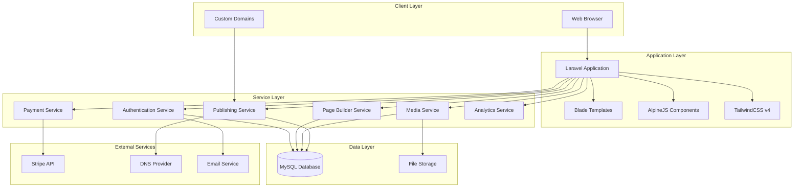

### 2.2 Product Features Summary

| Feature | Priority | Complexity |
|---------|----------|------------|
| User Authentication | High | Medium |
| Drag-and-Drop Builder | High | High |
| Template Management | High | Medium |
| Media Library | Medium | Medium |
| Page Publishing | High | High |
| Payment System | High | High |
| Analytics Dashboard | Medium | Medium |

### 2.3 User Classes and Characteristics

#### 2.3.1 Guest Users
- **Description:** Visitors who have not registered
- **Permissions:** View marketing pages, pricing, register/login
- **Technical Proficiency:** Varies

#### 2.3.2 Free Users
- **Description:** Registered users on free tier
- **Permissions:** Create up to 1 page, use basic templates, limited storage
- **Technical Proficiency:** Low to Medium
- **Usage Frequency:** Occasional

#### 2.3.3 Pro Users
- **Description:** Paid subscribers on Pro plan
- **Permissions:** Unlimited pages, all templates, custom domains, increased storage
- **Technical Proficiency:** Low to Medium
- **Usage Frequency:** Regular

#### 2.3.4 Business Users
- **Description:** Paid subscribers on Business plan
- **Permissions:** All Pro features, priority support, advanced analytics, team collaboration
- **Technical Proficiency:** Medium
- **Usage Frequency:** Frequent

#### 2.3.5 Administrators
- **Description:** System administrators
- **Permissions:** Full system access, user management, template management, system configuration
- **Technical Proficiency:** High
- **Usage Frequency:** Daily

### 2.4 Operating Environment

#### 2.4.1 Server Environment
- **Operating System:** Ubuntu 22.04 LTS or compatible Linux distribution
- **Web Server:** Nginx 1.24+ or Apache 2.4+
- **PHP Version:** 8.2+
- **Database:** MySQL 8.0+
- **Cache:** Redis 7.0+ (optional, for performance)

#### 2.4.2 Client Environment
- **Browsers:** Chrome 90+, Firefox 88+, Safari 14+, Edge 90+
- **JavaScript:** Enabled (required)
- **Screen Resolution:** Minimum 1280x720 (recommended 1920x1080)
- **Internet Connection:** Broadband recommended

### 2.5 Design and Implementation Constraints

#### 2.5.1 Technical Constraints
- **No Premium Plugins:** All functionality must be built from scratch or use free, open-source solutions
- **No Premium Resources:** Templates and assets must be original or use free resources
- **Framework Adherence:** Must follow Laravel conventions and best practices
- **Pattern Requirements:**
  - Service-Repository pattern for business logic
  - Observer pattern for event handling
  - Strategy pattern for payment processing

#### 2.5.2 Timeline Constraints
- **Total Development Time:** 2 weeks (10 working days)
- **MVP Focus:** Core features must be prioritized
- **Iterative Development:** Features should be developed incrementally

#### 2.5.3 Resource Constraints
- **Team Size:** Assumed small team (1-3 developers)
- **Budget:** Limited (no premium services)

### 2.6 Assumptions and Dependencies

#### 2.6.1 Assumptions
- Users have basic computer literacy
- Users have stable internet connections
- Modern web browsers are used
- Email service is available for transactional emails
- Stripe account is available for payment processing

#### 2.6.2 Dependencies
- Laravel framework availability and stability
- TailwindCSS v4 release stability
- AlpineJS compatibility with modern browsers
- Stripe API availability
- DNS propagation for custom domains
- SSL certificate provisioning service

---

## 3. System Features

### 3.1 User Authentication & Authorization

#### 3.1.1 Description
A comprehensive authentication system that manages user registration, login, password management, and role-based access control. Inspired by Webflow's clean authentication flow and Squarespace's seamless onboarding.

#### 3.1.2 Functional Requirements

##### FR-AUTH-001: User Registration
- **Priority:** High
- **Description:** System shall allow new users to create accounts
- **Input:** Email, password, name
- **Process:**
  1. Validate email format and uniqueness
  2. Validate password strength (minimum 8 characters, mixed case, numbers)
  3. Hash password using bcrypt
  4. Create user record in database
  5. Send verification email
  6. Create default workspace
- **Output:** User account created, verification email sent
- **Error Handling:** Display validation errors, handle duplicate emails

##### FR-AUTH-002: Email Verification
- **Priority:** High
- **Description:** System shall verify user email addresses
- **Process:**
  1. Generate unique verification token
  2. Send verification link to user email
  3. Validate token on click
  4. Mark email as verified
  5. Allow access to protected features
- **Token Expiry:** 24 hours

##### FR-AUTH-003: User Login
- **Priority:** High
- **Description:** System shall authenticate users
- **Input:** Email, password
- **Process:**
  1. Validate credentials
  2. Check email verification status
  3. Create session
  4. Update last login timestamp
  5. Redirect to dashboard
- **Security:** Rate limiting (5 attempts per minute), account lockout after 10 failed attempts

##### FR-AUTH-004: Password Reset
- **Priority:** High
- **Description:** System shall allow users to reset forgotten passwords
- **Process:**
  1. User requests reset via email
  2. Generate secure reset token
  3. Send reset link to email
  4. Validate token and allow new password entry
  5. Update password and invalidate token
- **Token Expiry:** 1 hour

##### FR-AUTH-005: Role-Based Access Control
- **Priority:** High
- **Description:** System shall enforce permissions based on user roles
- **Roles:**
  - Guest: Public pages only
  - Free User: Limited features
  - Pro User: Full features, limited resources
  - Business User: All features, extended resources
  - Admin: Full system access

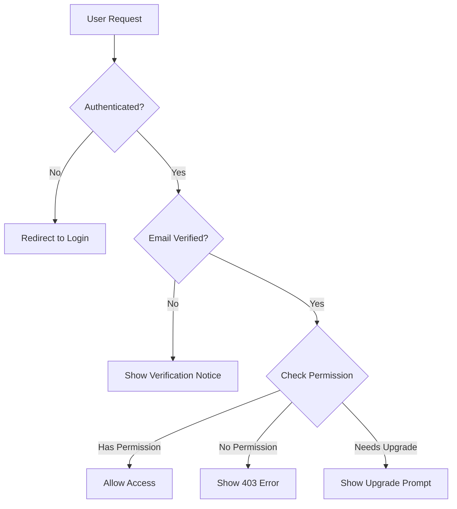

##### FR-AUTH-006: Session Management
- **Priority:** Medium
- **Description:** System shall manage user sessions securely
- **Features:**
  - Session timeout: 2 hours of inactivity
  - Remember me: 30 days
  - Single session per device (optional)
  - Session invalidation on password change

##### FR-AUTH-007: Profile Management
- **Priority:** Medium
- **Description:** Users shall be able to manage their profile
- **Editable Fields:** Name, email, password, avatar, timezone
- **Validation:** Email change requires re-verification

#### 3.1.3 Use Cases

**UC-AUTH-001: New User Registration**
```
Actor: Guest User
Precondition: User is not logged in
Main Flow:
1. User navigates to registration page
2. User enters email, password, and name
3. System validates input
4. System creates account
5. System sends verification email
6. User is redirected to verification notice page
Alternative Flow:
3a. Validation fails - Display errors and allow correction
Postcondition: User account created, awaiting verification
```

### 3.2 Drag-and-Drop Page Builder

#### 3.2.1 Description
A visual, WordPress-like WYSIWYG editor that allows users to build landing pages by dragging and dropping components. Inspired by Unbounce's conversion-focused builder and Leadpages' simplicity.

#### 3.2.2 Functional Requirements

##### FR-BUILDER-001: Canvas Interface
- **Priority:** High
- **Description:** System shall provide a visual editing canvas
- **Features:**
  - Real-time preview of changes
  - Responsive design preview (desktop, tablet, mobile)
  - Zoom controls (50% - 200%)
  - Grid and guide overlays
  - Undo/redo functionality (up to 50 actions)

##### FR-BUILDER-002: Component Library
- **Priority:** High
- **Description:** System shall provide draggable UI components
- **Basic Components:**
  - Heading (H1-H6)
  - Paragraph text
  - Button
  - Image
  - Video embed
  - Divider
  - Spacer
- **Layout Components:**
  - Container
  - Row/Columns (1-4 columns)
  - Section
- **Form Components:**
  - Input field
  - Textarea
  - Select dropdown
  - Checkbox
  - Radio button
  - Submit button
- **Advanced Components:**
  - Navigation menu
  - Footer
  - Testimonial card
  - Pricing table
  - FAQ accordion
  - Contact form
  - Social media icons
  - Countdown timer
  - Hero section

##### FR-BUILDER-003: Drag-and-Drop Functionality
- **Priority:** High
- **Description:** Users shall be able to drag components onto the canvas
- **Features:**
  - Visual drag indicators
  - Drop zone highlighting
  - Snap-to-grid alignment
  - Component reordering
  - Nested component support
  - Copy/paste components
  - Delete with confirmation

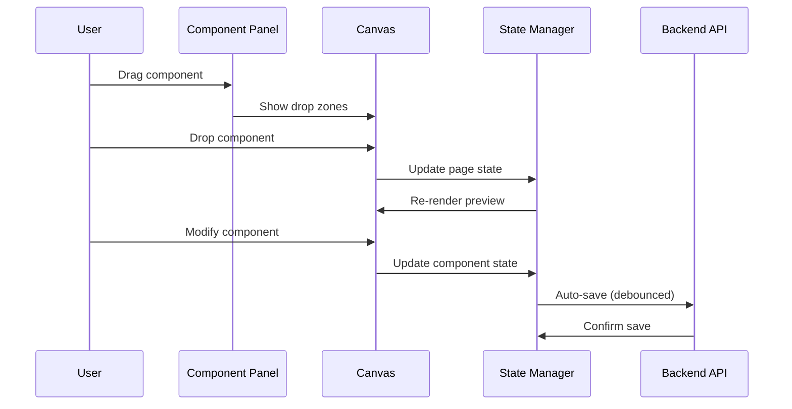

##### FR-BUILDER-004: Component Styling
- **Priority:** High
- **Description:** Users shall be able to style components
- **Style Options:**
  - Typography: Font family, size, weight, line height, letter spacing
  - Colors: Text color, background color, border color
  - Spacing: Margin, padding (all sides)
  - Borders: Width, style, radius
  - Shadows: Box shadow presets
  - Size: Width, height, max-width
  - Effects: Opacity, hover states
- **Implementation:** TailwindCSS classes applied dynamically

##### FR-BUILDER-005: Responsive Design Controls
- **Priority:** High
- **Description:** Users shall be able to customize designs for different screen sizes
- **Breakpoints:**
  - Desktop: 1280px+
  - Tablet: 768px - 1279px
  - Mobile: < 768px
- **Features:**
  - Device preview toggle
  - Breakpoint-specific styling
  - Hide/show components per breakpoint

##### FR-BUILDER-006: Auto-Save
- **Priority:** High
- **Description:** System shall automatically save changes
- **Behavior:**
  - Save after 3 seconds of inactivity
  - Save on component drop
  - Save before preview/publish
  - Visual save indicator
  - Conflict resolution for concurrent edits

##### FR-BUILDER-007: Page Settings
- **Priority:** High
- **Description:** Users shall be able to configure page-level settings
- **Settings:**
  - Page title
  - Meta description
  - Favicon
  - Social media preview (OG tags)
  - Custom CSS (Pro+)
  - Custom JavaScript (Business)
  - Background color/image

##### FR-BUILDER-008: Link Management
- **Priority:** Medium
- **Description:** Components shall support various link types
- **Link Types:**
  - External URL
  - Page anchor
  - Email (mailto:)
  - Phone (tel:)
  - File download

#### 3.2.3 Builder Architecture

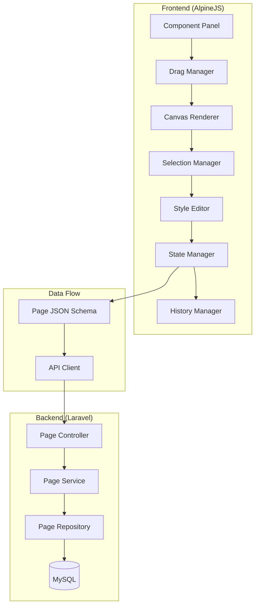

#### 3.2.4 Page Data Schema

```json
{
  "version": "1.0",
  "settings": {
    "title": "My Landing Page",
    "description": "Page meta description",
    "favicon": "/storage/favicons/icon.png",
    "backgroundColor": "#ffffff",
    "customCSS": "",
    "customJS": ""
  },
  "components": [
    {
      "id": "comp_uuid_1",
      "type": "section",
      "props": {
        "backgroundColor": "#f3f4f6",
        "padding": {
          "desktop": "py-16",
          "tablet": "py-12",
          "mobile": "py-8"
        }
      },
      "children": [
        {
          "id": "comp_uuid_2",
          "type": "heading",
          "props": {
            "text": "Welcome to Our Service",
            "level": "h1",
            "fontSize": {
              "desktop": "text-5xl",
              "tablet": "text-4xl",
              "mobile": "text-3xl"
            },
            "textAlign": "text-center",
            "textColor": "text-gray-900"
          },
          "children": []
        }
      ]
    }
  ]
}
```

### 3.3 Template Management System

#### 3.3.1 Description
A system for managing, browsing, and applying pre-designed page templates. Inspired by Squarespace's curated template gallery and Unbounce's conversion-optimized templates.

#### 3.3.2 Functional Requirements

##### FR-TMPL-001: Template Gallery
- **Priority:** High
- **Description:** System shall display available templates
- **Features:**
  - Grid view with thumbnails
  - Category filtering
  - Search functionality
  - Preview mode (full page preview)
  - Template details (name, description, category)

##### FR-TMPL-002: Template Categories
- **Priority:** High
- **Description:** Templates shall be organized by category
- **Categories:**
  - Lead Generation
  - Product Launch
  - Coming Soon
  - Event/Webinar
  - Portfolio
  - Service Business
  - E-commerce (simple)
  - App Download
  - Thank You Pages

##### FR-TMPL-003: Template Application
- **Priority:** High
- **Description:** Users shall be able to apply templates to new pages
- **Process:**
  1. User selects template
  2. System creates new page from template
  3. User is redirected to builder
  4. All components are editable

##### FR-TMPL-004: User Saved Templates
- **Priority:** Medium
- **Description:** Users shall be able to save their pages as templates
- **Features:**
  - Save current page as template
  - Name and categorize
  - Reuse across projects
  - Delete saved templates
- **Limits:**
  - Free: 1 saved template
  - Pro: 10 saved templates
  - Business: Unlimited

##### FR-TMPL-005: Admin Template Management
- **Priority:** High
- **Description:** Admins shall be able to manage system templates
- **Features:**
  - Create new templates
  - Edit existing templates
  - Publish/unpublish templates
  - Set featured templates
  - Assign categories
  - Upload preview images

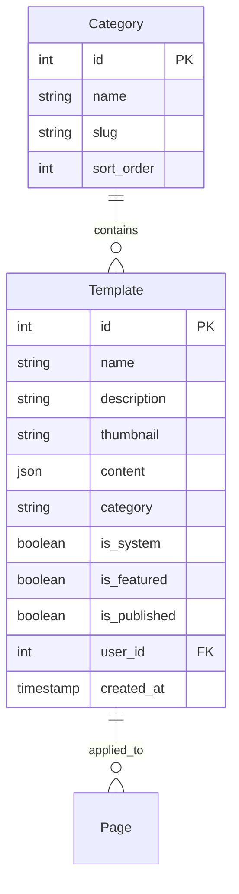

### 3.4 Media Library

#### 3.4.1 Description
A centralized system for uploading, managing, and using media assets across pages. Inspired by WordPress Media Library and Wix's media management.

#### 3.4.2 Functional Requirements

##### FR-MEDIA-001: File Upload
- **Priority:** High
- **Description:** Users shall be able to upload media files
- **Supported Formats:**
  - Images: JPG, PNG, GIF, SVG, WebP
  - Videos: MP4, WebM (links only, not hosting)
  - Documents: PDF (for download links)
- **Upload Methods:**
  - Drag and drop
  - File browser
  - URL import
- **Validation:**
  - File type verification
  - File size limits
  - Malware scanning (basic)

##### FR-MEDIA-002: Storage Limits
- **Priority:** High
- **Description:** System shall enforce storage limits by plan
- **Limits:**
  - Free: 100 MB
  - Pro: 5 GB
  - Business: 50 GB
- **Features:**
  - Storage usage display
  - Warning at 80% capacity
  - Block uploads at limit

##### FR-MEDIA-003: Image Optimization
- **Priority:** High
- **Description:** System shall automatically optimize uploaded images
- **Optimizations:**
  - Automatic compression (configurable quality)
  - Generate thumbnails (150px, 300px, 600px)
  - WebP conversion (with fallback)
  - Lazy loading support

##### FR-MEDIA-004: Media Organization
- **Priority:** Medium
- **Description:** Users shall be able to organize media files
- **Features:**
  - Folder creation
  - Search by filename
  - Sort by date, name, size
  - Bulk selection
  - Bulk delete

##### FR-MEDIA-005: Media Selection in Builder
- **Priority:** High
- **Description:** Builder shall integrate with media library
- **Features:**
  - Open media library modal from image components
  - Recent uploads quick access
  - Search within modal
  - Upload new from modal
  - Preview before selection

##### FR-MEDIA-006: Alt Text Management
- **Priority:** Medium
- **Description:** Users shall be able to set alt text for images
- **Features:**
  - Edit alt text in media library
  - Override alt text in builder
  - Alt text validation warnings

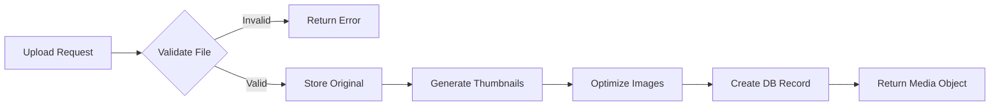

### 3.5 Page Publishing & Custom Domains

#### 3.5.1 Description
System for publishing pages to production and managing custom domain connections. Inspired by Webflow's hosting and Leadpages' publishing workflow.

#### 3.5.2 Functional Requirements

##### FR-PUB-001: Page Publishing
- **Priority:** High
- **Description:** Users shall be able to publish pages
- **Process:**
  1. User clicks publish button
  2. System validates page content
  3. System generates static HTML
  4. Page becomes publicly accessible
  5. User receives published URL
- **Status States:** Draft, Published, Unpublished

##### FR-PUB-002: Subdomain Publishing
- **Priority:** High
- **Description:** Free pages shall be published on system subdomain
- **Format:** `{username}-{page-slug}.{app-domain}`
- **Example:** `john-summer-sale.landingbuilder.app`

##### FR-PUB-003: Custom Domain Connection
- **Priority:** High
- **Description:** Pro+ users shall be able to connect custom domains
- **Process:**
  1. User enters custom domain
  2. System provides DNS records (CNAME/A record)
  3. User configures DNS at registrar
  4. System verifies DNS configuration
  5. System provisions SSL certificate
  6. Domain becomes active

##### FR-PUB-004: SSL Certificate Management
- **Priority:** High
- **Description:** System shall automatically provision SSL certificates
- **Features:**
  - Let's Encrypt integration
  - Automatic renewal
  - Force HTTPS redirect
  - Certificate status display

##### FR-PUB-005: DNS Verification
- **Priority:** High
- **Description:** System shall verify domain ownership
- **Process:**
  1. Check CNAME/A record points to system
  2. Verify within 24 hours
  3. Retry on failure
  4. Notify user of status
- **Verification Interval:** Every 5 minutes for first hour, then hourly

##### FR-PUB-006: Page Versioning
- **Priority:** Medium
- **Description:** System shall maintain page versions
- **Features:**
  - Auto-version on publish
  - View version history
  - Restore previous versions
  - Compare versions (Pro+)
- **Retention:**
  - Free: 3 versions
  - Pro: 10 versions
  - Business: Unlimited

##### FR-PUB-007: Unpublish Page
- **Priority:** High
- **Description:** Users shall be able to unpublish pages
- **Behavior:**
  - Page returns 404
  - Page remains in builder
  - Can be republished

##### FR-PUB-008: Published Page Analytics Script Injection
- **Priority:** Medium
- **Description:** System shall inject analytics tracking into published pages
- **Injections:**
  - System analytics script
  - User's custom scripts (Business)

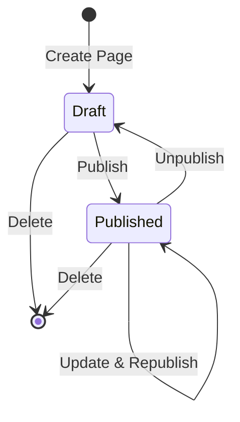

##### Domain Connection Flow

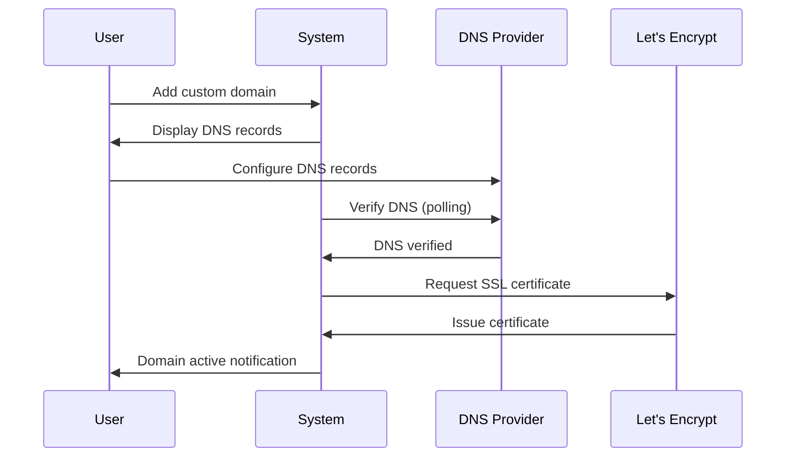

### 3.6 Subscription/Payment System

#### 3.6.1 Description
A subscription management system using Stripe for payment processing. Implements Strategy pattern for payment flexibility. Inspired by standard SaaS billing practices.

#### 3.6.2 Functional Requirements

##### FR-PAY-001: Subscription Plans
- **Priority:** High
- **Description:** System shall offer tiered subscription plans
- **Plans:**

| Feature | Free | Pro ($19/mo) | Business ($49/mo) |
|---------|------|--------------|-------------------|
| Pages | 1 | 10 | Unlimited |
| Templates | Basic | All | All + Priority |
| Storage | 100 MB | 5 GB | 50 GB |
| Custom Domain | No | Yes | Yes |
| Remove Branding | No | Yes | Yes |
| Analytics | Basic | Advanced | Advanced |
| Support | Community | Email | Priority |
| Custom Code | No | CSS | CSS + JS |
| Team Members | 1 | 1 | 5 |

##### FR-PAY-002: Stripe Integration
- **Priority:** High
- **Description:** System shall process payments through Stripe
- **Features:**
  - Secure card tokenization
  - PCI compliance (via Stripe)
  - Support for major credit cards
  - Stripe Customer portal integration

##### FR-PAY-003: Subscription Lifecycle
- **Priority:** High
- **Description:** System shall manage subscription states
- **States:** Trial, Active, Past Due, Canceled, Expired
- **Transitions:**
  - Trial → Active (payment successful)
  - Active → Past Due (payment failed)
  - Past Due → Canceled (after retries)
  - Active → Canceled (user cancels)

##### FR-PAY-004: Payment Method Management
- **Priority:** High
- **Description:** Users shall be able to manage payment methods
- **Features:**
  - Add/update credit card
  - View saved cards
  - Set default payment method
  - Remove payment methods

##### FR-PAY-005: Invoice Management
- **Priority:** High
- **Description:** System shall generate and store invoices
- **Features:**
  - Automatic invoice generation
  - PDF download
  - Invoice history
  - Email invoice receipts

##### FR-PAY-006: Plan Upgrades/Downgrades
- **Priority:** High
- **Description:** Users shall be able to change plans
- **Behavior:**
  - Upgrades: Immediate, prorated
  - Downgrades: End of billing period
  - Feature access adjusted accordingly

##### FR-PAY-007: Cancellation Flow
- **Priority:** High
- **Description:** Users shall be able to cancel subscriptions
- **Process:**
  1. User initiates cancellation
  2. Show retention offer (optional)
  3. Collect cancellation reason
  4. Confirm cancellation
  5. Access until period end
  6. Downgrade to Free tier

##### FR-PAY-008: Webhook Handling
- **Priority:** High
- **Description:** System shall handle Stripe webhooks
- **Events:**
  - `customer.subscription.created`
  - `customer.subscription.updated`
  - `customer.subscription.deleted`
  - `invoice.payment_succeeded`
  - `invoice.payment_failed`

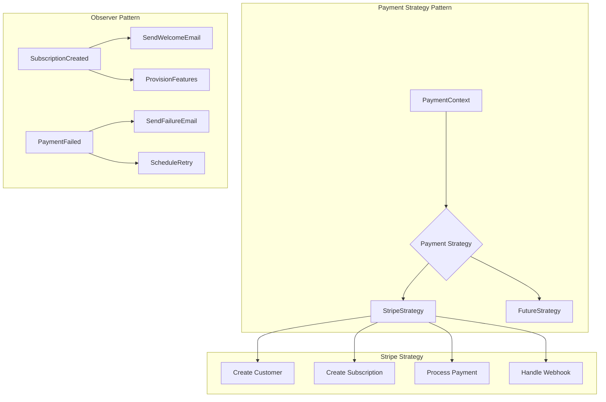

##### FR-PAY-009: Grace Period
- **Priority:** Medium
- **Description:** System shall provide grace period for failed payments
- **Behavior:**
  - 3 retry attempts over 7 days
  - Email notification on each failure
  - Feature degradation after grace period

##### FR-PAY-010: Usage Tracking
- **Priority:** Medium
- **Description:** System shall track usage against plan limits
- **Tracked Metrics:**
  - Number of pages
  - Storage used
  - Team members
- **Enforcement:**
  - Soft limits: Warning
  - Hard limits: Block action

### 3.7 Analytics Dashboard

#### 3.7.1 Description
A dashboard for tracking page performance metrics. Provides basic analytics without external dependencies. Inspired by Unbounce's conversion tracking.

#### 3.7.2 Functional Requirements

##### FR-ANALYTICS-001: Page View Tracking
- **Priority:** High
- **Description:** System shall track page views
- **Metrics:**
  - Total page views
  - Unique visitors (cookie-based)
  - Views over time (daily/weekly/monthly)
- **Implementation:** Lightweight JavaScript tracker

##### FR-ANALYTICS-002: Traffic Sources
- **Priority:** Medium
- **Description:** System shall track traffic sources
- **Sources:**
  - Direct
  - Referral (with domain)
  - Social media
  - Search engines
  - UTM parameters

##### FR-ANALYTICS-003: Device Analytics
- **Priority:** Medium
- **Description:** System shall track visitor devices
- **Metrics:**
  - Device type (desktop/tablet/mobile)
  - Browser
  - Operating system

##### FR-ANALYTICS-004: Geographic Data
- **Priority:** Medium
- **Description:** System shall track visitor locations
- **Metrics:**
  - Country
  - City (Pro+)
- **Implementation:** IP geolocation (free database)

##### FR-ANALYTICS-005: Form Submission Tracking
- **Priority:** High
- **Description:** System shall track form submissions
- **Metrics:**
  - Total submissions
  - Submission rate (conversions)
  - Form field data storage

##### FR-ANALYTICS-006: Dashboard Visualization
- **Priority:** High
- **Description:** System shall display analytics visually
- **Visualizations:**
  - Line charts (views over time)
  - Bar charts (top pages)
  - Pie charts (traffic sources)
  - Data tables (detailed breakdowns)
- **Date Range:** 7d, 30d, 90d, custom (Pro+)

##### FR-ANALYTICS-007: Data Export
- **Priority:** Medium
- **Description:** Pro+ users shall export analytics data
- **Formats:** CSV
- **Data:** All tracked metrics

##### FR-ANALYTICS-008: Real-time Stats
- **Priority:** Low
- **Description:** Business users shall see real-time visitor count
- **Update Frequency:** Every 30 seconds

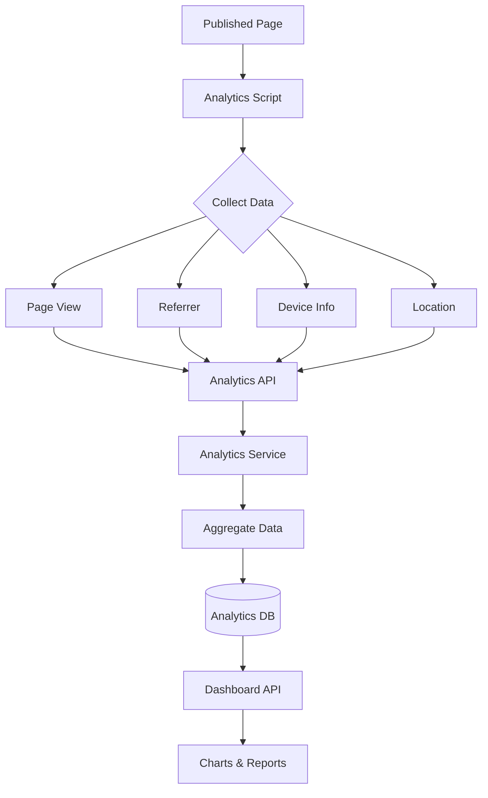

---

## 4. External Interface Requirements

### 4.1 User Interface Requirements

#### 4.1.1 General UI Guidelines
- **Design System:** Clean, modern, minimalist (Webflow/Squarespace inspired)
- **Color Scheme:** Neutral base with accent colors for actions
- **Typography:** System fonts for performance, clean sans-serif
- **Spacing:** Consistent 4px/8px grid system
- **Responsiveness:** Full mobile responsiveness for dashboard

#### 4.1.2 Navigation Structure

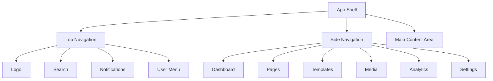

#### 4.1.3 Key Interface Screens

| Screen | Description | Key Components |
|--------|-------------|----------------|
| Dashboard | Overview of user's account | Stats cards, recent pages, quick actions |
| Page List | Grid of user's pages | Page cards, filters, create button |
| Page Builder | Full-screen editor | Canvas, component panel, style panel |
| Template Gallery | Browse templates | Template grid, filters, preview modal |
| Media Library | Manage files | File grid, upload zone, folder nav |
| Analytics | View page stats | Charts, date picker, data tables |
| Settings | User preferences | Tabs: Profile, Billing, Domains, Team |

#### 4.1.4 UI Component Library

Built with TailwindCSS v4 and AlpineJS:
- Buttons (primary, secondary, danger, sizes)
- Form inputs (text, select, checkbox, radio)
- Cards (page card, stat card, template card)
- Modals (confirm, form, media picker)
- Dropdowns (menu, select)
- Tabs (horizontal, vertical)
- Tables (sortable, paginated)
- Alerts (success, error, warning, info)
- Loading states (spinners, skeletons)
- Tooltips and popovers

#### 4.1.5 Builder-Specific UI

```
+------------------------------------------------------------------+
|  Logo    Page: Untitled    [Desktop|Tablet|Mobile]  [Preview][Pub]|
+------------------------------------------------------------------+
|          |                                        |               |
| ELEMENTS |                                        |    STYLES     |
|          |                                        |               |
| [Search] |         CANVAS AREA                    | [Component]   |
|          |                                        |               |
| Layout   |    +------------------------+          | Typography    |
|  Section |    |                        |          |  Font         |
|  Container|   |    Selected            |          |  Size         |
|  Grid    |    |    Component           |          |  Color        |
|          |    |                        |          |               |
| Basic    |    +------------------------+          | Spacing       |
|  Heading |                                        |  Margin       |
|  Text    |                                        |  Padding      |
|  Button  |                                        |               |
|  Image   |                                        | Background    |
|          |                                        | Border        |
| Forms    |                                        | Effects       |
|  Input   |                                        |               |
|  Select  |                                        |               |
|          |                                        |               |
+------------------------------------------------------------------+
```

### 4.2 Hardware Interface Requirements

#### 4.2.1 Server Requirements
- **Minimum:** 2 CPU cores, 4 GB RAM, 50 GB SSD
- **Recommended:** 4 CPU cores, 8 GB RAM, 100 GB SSD
- **Network:** 100 Mbps minimum bandwidth

#### 4.2.2 Client Requirements
- **Minimum:** 2 GB RAM, 1280x720 display
- **Recommended:** 4 GB RAM, 1920x1080 display
- **Input:** Mouse/trackpad and keyboard required for builder

### 4.3 Software Interface Requirements

#### 4.3.1 Backend Dependencies

| Component | Version | Purpose |
|-----------|---------|---------|
| PHP | 8.2+ | Runtime |
| Laravel | 11.x | Framework |
| MySQL | 8.0+ | Database |
| Composer | 2.x | Dependency management |
| Redis | 7.0+ | Caching (optional) |

#### 4.3.2 Frontend Dependencies

| Component | Version | Purpose |
|-----------|---------|---------|
| TailwindCSS | 4.x | Styling |
| AlpineJS | 3.x | Interactivity |
| SortableJS | 1.15 | Drag-and-drop |
| Chart.js | 4.x | Analytics charts |

#### 4.3.3 External Service Integrations

| Service | Purpose | Integration Method |
|---------|---------|-------------------|
| Stripe | Payments | REST API + Webhooks |
| SMTP Service | Emails | Laravel Mail |
| Let's Encrypt | SSL | ACME Protocol |

### 4.4 Communication Interface Requirements

#### 4.4.1 HTTP/HTTPS
- All traffic over HTTPS (TLS 1.3)
- HTTP to HTTPS redirect enforced
- HSTS headers implemented

#### 4.4.2 API Communication
- RESTful API for builder operations
- JSON request/response format
- CSRF protection for forms
- Rate limiting: 60 requests/minute (authenticated)

#### 4.4.3 WebSocket (Optional)
- Real-time collaboration notifications
- Live analytics updates (Business tier)

#### 4.4.4 Email Communication
- Transactional emails (verification, password reset)
- Notification emails (payment, publishing)
- SMTP with TLS encryption

---

## 5. Non-functional Requirements

### 5.1 Performance Requirements

#### 5.1.1 Response Time

| Operation | Target | Maximum |
|-----------|--------|---------|
| Page load (dashboard) | < 1s | < 2s |
| Builder initialization | < 2s | < 4s |
| Component drag/drop | < 100ms | < 200ms |
| Auto-save | < 500ms | < 1s |
| Publish page | < 3s | < 5s |
| API requests | < 200ms | < 500ms |

#### 5.1.2 Throughput
- Support 100 concurrent users minimum
- Handle 1000 requests/minute
- Process 10 publishes/minute

#### 5.1.3 Resource Utilization
- Average CPU usage < 60%
- Memory usage < 80% of available
- Database connections < 80% of pool

#### 5.1.4 Optimization Strategies
- Database query optimization with indexes
- Eager loading to prevent N+1 queries
- Asset minification and bundling
- Image optimization and lazy loading
- Browser caching for static assets
- CDN for published pages (future)

### 5.2 Security Requirements

#### 5.2.1 Authentication Security
- Password hashing with bcrypt (cost 12)
- Account lockout after failed attempts
- Session timeout and invalidation
- Secure remember-me tokens

#### 5.2.2 Authorization Security
- Role-based access control
- Resource ownership verification
- Middleware-based protection

#### 5.2.3 Data Security
- HTTPS everywhere
- Database encryption at rest
- Sensitive data encryption (API keys)
- SQL injection prevention (Eloquent ORM)
- XSS prevention (Blade escaping)
- CSRF protection (Laravel default)

#### 5.2.4 File Upload Security
- File type validation (MIME + extension)
- File size limits
- Virus scanning (ClamAV optional)
- Secure storage paths
- No direct file execution

#### 5.2.5 API Security
- Rate limiting
- Input validation
- Output sanitization
- CORS configuration

#### 5.2.6 Compliance
- GDPR considerations (data export, deletion)
- PCI DSS (delegated to Stripe)
- Cookie consent for analytics

### 5.3 Scalability Requirements

#### 5.3.1 Vertical Scaling
- Application can utilize increased server resources
- No hardcoded resource limits in code

#### 5.3.2 Horizontal Scaling (Future)
- Stateless application design
- Session storage in database/Redis
- Shared file storage support
- Database read replicas support

#### 5.3.3 Growth Projections

| Metric | MVP | 6 Months | 1 Year |
|--------|-----|----------|--------|
| Users | 100 | 1,000 | 10,000 |
| Pages | 200 | 5,000 | 100,000 |
| Storage | 10 GB | 500 GB | 5 TB |
| Requests/day | 10,000 | 100,000 | 1,000,000 |

### 5.4 Reliability Requirements

#### 5.4.1 Availability
- Target uptime: 99.5%
- Maximum planned downtime: 4 hours/month
- Maintenance window: Sundays 2-6 AM UTC

#### 5.4.2 Fault Tolerance
- Graceful degradation on service failures
- Automatic retry for transient errors
- Dead letter queues for failed jobs

#### 5.4.3 Data Backup
- Daily automated backups
- 30-day backup retention
- Point-in-time recovery for database
- Off-site backup storage

#### 5.4.4 Disaster Recovery
- Recovery Time Objective (RTO): 4 hours
- Recovery Point Objective (RPO): 24 hours
- Documented recovery procedures

#### 5.4.5 Monitoring
- Application error tracking
- Server resource monitoring
- Database performance monitoring
- Uptime monitoring with alerts

### 5.5 Maintainability Requirements

#### 5.5.1 Code Quality
- PSR-12 coding standard
- Laravel best practices
- Service-Repository pattern adherence
- Comprehensive code documentation

#### 5.5.2 Testing
- Unit tests for services
- Feature tests for API endpoints
- Browser tests for critical flows (optional)
- Minimum 60% code coverage target

#### 5.5.3 Deployment
- Zero-downtime deployments
- Rollback capability
- Environment-based configuration
- Migration management

#### 5.5.4 Documentation
- API documentation
- Database schema documentation
- Deployment procedures
- Troubleshooting guides

### 5.6 Usability Requirements

#### 5.6.1 Learnability
- New users can create a page within 10 minutes
- Intuitive drag-and-drop without tutorial
- Inline help and tooltips

#### 5.6.2 Efficiency
- Common tasks achievable in < 3 clicks
- Keyboard shortcuts for power users
- Bulk operations support

#### 5.6.3 Accessibility
- WCAG 2.1 Level AA compliance target
- Keyboard navigation support
- Screen reader compatibility
- Sufficient color contrast

#### 5.6.4 Error Handling
- Clear, actionable error messages
- Form validation with inline errors
- Recovery suggestions

---

## 6. Data Requirements

### 6.1 Data Dictionary

#### 6.1.1 Core Entities

##### Users Table
| Field | Type | Constraints | Description |
|-------|------|-------------|-------------|
| id | BIGINT | PK, AUTO | Unique identifier |
| name | VARCHAR(255) | NOT NULL | User's display name |
| email | VARCHAR(255) | UNIQUE, NOT NULL | Login email |
| password | VARCHAR(255) | NOT NULL | Bcrypt hash |
| email_verified_at | TIMESTAMP | NULLABLE | Verification time |
| avatar | VARCHAR(255) | NULLABLE | Profile image path |
| role | ENUM | DEFAULT 'user' | user, admin |
| timezone | VARCHAR(50) | DEFAULT 'UTC' | User timezone |
| remember_token | VARCHAR(100) | NULLABLE | Session token |
| last_login_at | TIMESTAMP | NULLABLE | Last login time |
| created_at | TIMESTAMP | NOT NULL | Creation time |
| updated_at | TIMESTAMP | NOT NULL | Last update time |

##### Pages Table
| Field | Type | Constraints | Description |
|-------|------|-------------|-------------|
| id | BIGINT | PK, AUTO | Unique identifier |
| user_id | BIGINT | FK, NOT NULL | Owner reference |
| title | VARCHAR(255) | NOT NULL | Page title |
| slug | VARCHAR(255) | NOT NULL | URL slug |
| content | JSON | NOT NULL | Page builder data |
| settings | JSON | NULLABLE | Page settings |
| status | ENUM | DEFAULT 'draft' | draft, published |
| published_at | TIMESTAMP | NULLABLE | Publish time |
| template_id | BIGINT | FK, NULLABLE | Source template |
| created_at | TIMESTAMP | NOT NULL | Creation time |
| updated_at | TIMESTAMP | NOT NULL | Last update time |

##### Templates Table
| Field | Type | Constraints | Description |
|-------|------|-------------|-------------|
| id | BIGINT | PK, AUTO | Unique identifier |
| name | VARCHAR(255) | NOT NULL | Template name |
| description | TEXT | NULLABLE | Template description |
| thumbnail | VARCHAR(255) | NULLABLE | Preview image |
| content | JSON | NOT NULL | Template structure |
| category | VARCHAR(100) | NOT NULL | Template category |
| is_system | BOOLEAN | DEFAULT false | System template |
| is_featured | BOOLEAN | DEFAULT false | Featured status |
| is_published | BOOLEAN | DEFAULT true | Visibility |
| user_id | BIGINT | FK, NULLABLE | Creator (if user) |
| created_at | TIMESTAMP | NOT NULL | Creation time |
| updated_at | TIMESTAMP | NOT NULL | Last update time |

##### Media Table
| Field | Type | Constraints | Description |
|-------|------|-------------|-------------|
| id | BIGINT | PK, AUTO | Unique identifier |
| user_id | BIGINT | FK, NOT NULL | Owner reference |
| filename | VARCHAR(255) | NOT NULL | Original filename |
| path | VARCHAR(255) | NOT NULL | Storage path |
| mime_type | VARCHAR(100) | NOT NULL | File MIME type |
| size | BIGINT | NOT NULL | File size (bytes) |
| alt_text | VARCHAR(255) | NULLABLE | Alt text |
| folder | VARCHAR(255) | DEFAULT '/' | Folder path |
| thumbnails | JSON | NULLABLE | Thumbnail paths |
| created_at | TIMESTAMP | NOT NULL | Upload time |

##### Domains Table
| Field | Type | Constraints | Description |
|-------|------|-------------|-------------|
| id | BIGINT | PK, AUTO | Unique identifier |
| user_id | BIGINT | FK, NOT NULL | Owner reference |
| page_id | BIGINT | FK, NOT NULL | Connected page |
| domain | VARCHAR(255) | UNIQUE, NOT NULL | Domain name |
| status | ENUM | DEFAULT 'pending' | pending, verified, failed |
| ssl_status | ENUM | DEFAULT 'pending' | pending, active, expired |
| verified_at | TIMESTAMP | NULLABLE | Verification time |
| created_at | TIMESTAMP | NOT NULL | Creation time |

##### Subscriptions Table
| Field | Type | Constraints | Description |
|-------|------|-------------|-------------|
| id | BIGINT | PK, AUTO | Unique identifier |
| user_id | BIGINT | FK, NOT NULL | Subscriber |
| plan | ENUM | NOT NULL | free, pro, business |
| stripe_subscription_id | VARCHAR(255) | NULLABLE | Stripe reference |
| stripe_customer_id | VARCHAR(255) | NULLABLE | Stripe customer |
| status | ENUM | NOT NULL | Status |
| trial_ends_at | TIMESTAMP | NULLABLE | Trial end |
| current_period_start | TIMESTAMP | NULLABLE | Period start |
| current_period_end | TIMESTAMP | NULLABLE | Period end |
| canceled_at | TIMESTAMP | NULLABLE | Cancellation time |
| created_at | TIMESTAMP | NOT NULL | Creation time |
| updated_at | TIMESTAMP | NOT NULL | Update time |

##### Page Views Table
| Field | Type | Constraints | Description |
|-------|------|-------------|-------------|
| id | BIGINT | PK, AUTO | Unique identifier |
| page_id | BIGINT | FK, NOT NULL | Page reference |
| visitor_id | VARCHAR(255) | NOT NULL | Cookie/session ID |
| ip_address | VARCHAR(45) | NOT NULL | Visitor IP |
| user_agent | TEXT | NULLABLE | Browser info |
| referrer | VARCHAR(500) | NULLABLE | Traffic source |
| country | VARCHAR(2) | NULLABLE | Country code |
| device_type | VARCHAR(20) | NULLABLE | desktop/tablet/mobile |
| created_at | TIMESTAMP | NOT NULL | View time |

##### Form Submissions Table
| Field | Type | Constraints | Description |
|-------|------|-------------|-------------|
| id | BIGINT | PK, AUTO | Unique identifier |
| page_id | BIGINT | FK, NOT NULL | Page reference |
| form_id | VARCHAR(255) | NOT NULL | Form component ID |
| data | JSON | NOT NULL | Submitted data |
| ip_address | VARCHAR(45) | NOT NULL | Submitter IP |
| created_at | TIMESTAMP | NOT NULL | Submission time |

### 6.2 Entity Relationship Diagram

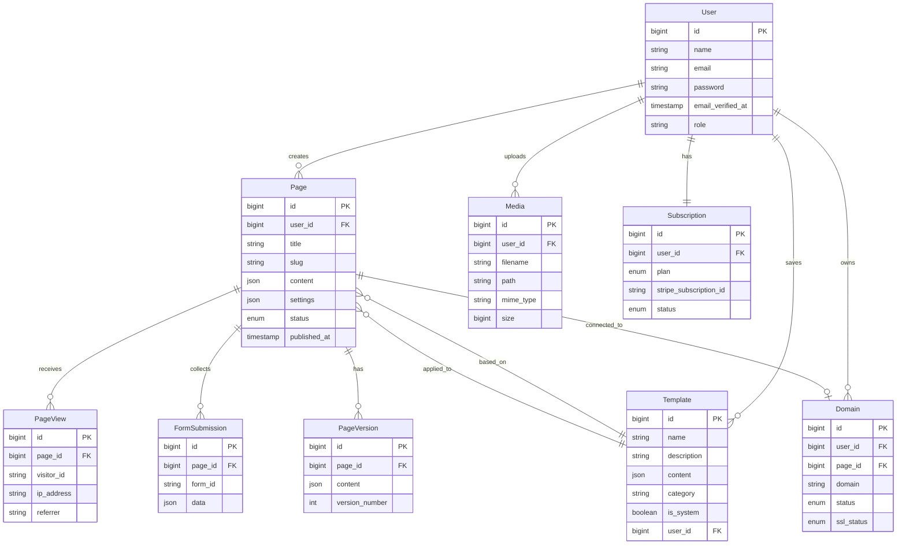

### 6.3 Data Integrity Rules

#### 6.3.1 Referential Integrity
- All foreign keys enforce referential integrity
- Cascade delete for: PageViews, FormSubmissions, PageVersions
- Restrict delete for: Users with pages, Pages with domains
- Set null for: Pages when template deleted

#### 6.3.2 Business Rules
- User email must be unique
- Page slug must be unique per user
- Domain must be globally unique
- One active subscription per user
- Media size cannot exceed plan limit

#### 6.3.3 Data Validation
- Email format validation
- URL/slug format validation
- JSON schema validation for page content
- File type validation for uploads

### 6.4 Data Migration Strategy

#### 6.4.1 Migration Order
1. Users table
2. Subscriptions table
3. Templates table
4. Pages table
5. Media table
6. Domains table
7. PageVersions table
8. PageViews table
9. FormSubmissions table

#### 6.4.2 Seed Data
- Admin user account
- Default subscription plans
- System templates (10 minimum)
- Sample categories

---

## 7. Appendices

### Appendix A: Development Timeline

#### Week 1: Foundation & Core Features

| Day | Tasks |
|-----|-------|
| 1 | Project setup, database design, authentication scaffolding |
| 2 | User management, role-based access, profile management |
| 3 | Page CRUD operations, builder data structure, auto-save |
| 4 | Template system, template gallery, template application |
| 5 | Media library upload, storage, optimization |

#### Week 2: Advanced Features & Polish

| Day | Tasks |
|-----|-------|
| 6 | Page builder UI, drag-and-drop, component library |
| 7 | Component styling, responsive controls, builder polish |
| 8 | Publishing system, subdomain routing, page rendering |
| 9 | Stripe integration, subscription management, webhooks |
| 10 | Analytics tracking, dashboard, testing & bug fixes |

### Appendix B: API Endpoints

#### Authentication
- `POST /register` - User registration
- `POST /login` - User login
- `POST /logout` - User logout
- `POST /password/email` - Password reset request
- `POST /password/reset` - Password reset
- `GET /email/verify/{id}/{hash}` - Email verification

#### Pages
- `GET /api/pages` - List user's pages
- `POST /api/pages` - Create page
- `GET /api/pages/{id}` - Get page
- `PUT /api/pages/{id}` - Update page
- `DELETE /api/pages/{id}` - Delete page
- `POST /api/pages/{id}/publish` - Publish page
- `POST /api/pages/{id}/unpublish` - Unpublish page
- `POST /api/pages/{id}/duplicate` - Duplicate page

#### Templates
- `GET /api/templates` - List templates
- `GET /api/templates/{id}` - Get template
- `POST /api/templates` - Save as template
- `DELETE /api/templates/{id}` - Delete saved template

#### Media
- `GET /api/media` - List media files
- `POST /api/media` - Upload file
- `PUT /api/media/{id}` - Update media metadata
- `DELETE /api/media/{id}` - Delete file
- `POST /api/media/folder` - Create folder

#### Domains
- `GET /api/domains` - List user's domains
- `POST /api/domains` - Add domain
- `DELETE /api/domains/{id}` - Remove domain
- `POST /api/domains/{id}/verify` - Verify domain

#### Subscriptions
- `GET /api/subscription` - Get current subscription
- `POST /api/subscription` - Create subscription
- `PUT /api/subscription` - Update subscription
- `DELETE /api/subscription` - Cancel subscription
- `GET /api/invoices` - List invoices

#### Analytics
- `GET /api/analytics/pages/{id}` - Page analytics
- `GET /api/analytics/overview` - Account overview

### Appendix C: Component Specifications

#### Basic Components

| Component | Props | Description |
|-----------|-------|-------------|
| Heading | text, level (h1-h6), align | Text heading |
| Paragraph | text, align | Body text |
| Button | text, url, style, size | Clickable button |
| Image | src, alt, width, link | Image element |
| Video | url, autoplay, controls | Video embed |
| Divider | style, color, width | Horizontal rule |
| Spacer | height | Vertical space |

#### Layout Components

| Component | Props | Description |
|-----------|-------|-------------|
| Section | background, padding, width | Page section |
| Container | maxWidth, padding | Content wrapper |
| Row | columns, gap | Column container |
| Column | span, align | Grid column |

#### Form Components

| Component | Props | Description |
|-----------|-------|-------------|
| Form | action, method, fields | Form wrapper |
| Input | label, type, placeholder, required | Text input |
| Textarea | label, placeholder, rows | Multi-line input |
| Select | label, options, required | Dropdown |
| Checkbox | label, checked | Checkbox input |
| Radio | label, options, name | Radio group |
| Submit | text, style | Submit button |

### Appendix D: Environment Configuration

```env
# Application
APP_NAME="Landing Page Builder"
APP_ENV=production
APP_KEY=
APP_DEBUG=false
APP_URL=https://app.example.com

# Database
DB_CONNECTION=mysql
DB_HOST=127.0.0.1
DB_PORT=3306
DB_DATABASE=landing_builder
DB_USERNAME=
DB_PASSWORD=

# Cache & Session
CACHE_DRIVER=redis
SESSION_DRIVER=redis
QUEUE_CONNECTION=redis

# Mail
MAIL_MAILER=smtp
MAIL_HOST=
MAIL_PORT=587
MAIL_USERNAME=
MAIL_PASSWORD=
MAIL_ENCRYPTION=tls
MAIL_FROM_ADDRESS=noreply@example.com

# Stripe
STRIPE_KEY=
STRIPE_SECRET=
STRIPE_WEBHOOK_SECRET=

# Storage
FILESYSTEM_DISK=local
MEDIA_MAX_SIZE=10240

# Features
FEATURES_CUSTOM_DOMAINS=true
FEATURES_ANALYTICS=true
```

### Appendix E: Security Checklist

- [ ] HTTPS enforced on all routes
- [ ] CSRF protection enabled
- [ ] SQL injection prevention (parameterized queries)
- [ ] XSS protection (output escaping)
- [ ] Password hashing (bcrypt)
- [ ] Rate limiting on authentication routes
- [ ] File upload validation
- [ ] Secure session configuration
- [ ] Environment variables for secrets
- [ ] Input validation on all forms
- [ ] Authorization checks on all resources
- [ ] CORS properly configured
- [ ] Security headers set (CSP, X-Frame-Options, etc.)
- [ ] Sensitive data encryption
- [ ] Audit logging for admin actions

### Appendix F: Testing Strategy

#### Unit Tests
- Service classes
- Repository classes
- Helper functions
- Model methods

#### Feature Tests
- Authentication flows
- API endpoints
- Payment webhooks
- Publishing workflow

#### Browser Tests (Optional)
- Page builder interactions
- Template application
- Media upload
- Form submissions

#### Test Coverage Goals
- Services: 80%
- Controllers: 70%
- Models: 60%
- Overall: 60%+

### Appendix G: Glossary

| Term | Definition |
|------|------------|
| Canvas | The visual editing area in the page builder |
| Component | A reusable UI element (button, heading, etc.) |
| Landing Page | A standalone web page for marketing purposes |
| Publish | Making a page publicly accessible |
| Slug | URL-friendly version of a page title |
| Template | Pre-designed page layout |
| Viewport | The visible area of a web page |
| Webhook | HTTP callback for event notifications |

---

## Document Approval

| Role | Name | Date | Signature |
|------|------|------|-----------|
| Project Lead | | | |
| Tech Lead | | | |
| QA Lead | | | |
| Stakeholder | | | |

---

**Document Control:**
- **Version:** 1.0
- **Status:** Draft
- **Last Modified:** November 22, 2025
- **Next Review:** Before Development Start
