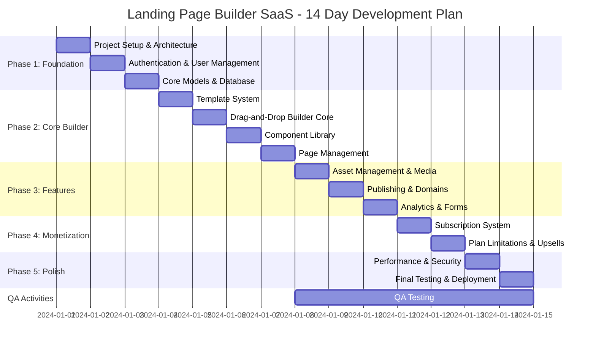
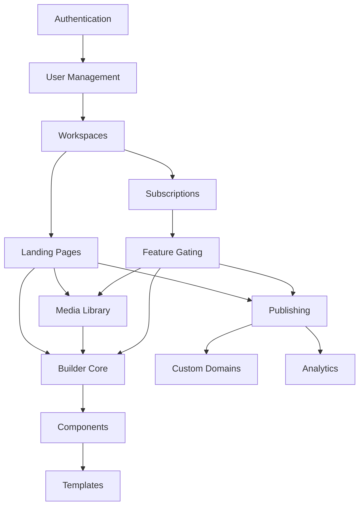

# Landing Page Builder SaaS - Project Plan

> **⚠️ IMPORTANT: TECH STACK UPDATE**
>
> This plan was created with the original approach using **AlpineJS** for the page builder. The **actual implementation uses Vue.js 3 + Pinia** for the page builder SPA.
>
> **For Current Implementation**, see:
> - [docs/REVISED-WIDGET-IMPLEMENTATION-PLAN.md](REVISED-WIDGET-IMPLEMENTATION-PLAN.md) - 3-4 day plan for completing widget system
> - [docs/frontend/03-DRAG-DROP-BUILDER.md](frontend/03-DRAG-DROP-BUILDER.md) - Vue.js builder architecture
> - [CLAUDE.md](../CLAUDE.md) - Actual project status (75% complete, 22 widgets working)

## Project Overview

**Project Name:** Landing Page Builder SaaS
**Duration:** 14 Days (2 Weeks)
**Start Date:** Day 1
**End Date:** Day 14

### Tech Stack (Original Plan)

> **NOTE:** Actual implementation differs from plan below. See warning above.

- **Backend:** Laravel 12 (Service-Repository, Observer, Strategy patterns)
- **Frontend (Page Builder):** Vue.js 3 + Pinia + Vite 5.x ← **ACTUAL IMPLEMENTATION**
- **Frontend (Dashboard/Marketing):** TailwindCSS v4, AlpineJS, Blade Templates
- **Database:** MySQL 8.0
- **Additional:** Redis (caching), Laravel Sanctum (API auth)

### Objective
Build a fully functional SaaS platform enabling users to create, customize, and publish landing pages through a drag-and-drop interface with subscription-based monetization.

---

## Team Structure

| Role | Responsibilities | Allocation |
|------|------------------|------------|
| **Tech Lead** | Architecture decisions, code reviews, pattern implementation | 100% |
| **Backend Developer** | Laravel services, repositories, API endpoints | 100% |
| **Frontend Developer (Builder)** | Vue.js 3 SPA, Pinia stores, widget components, TailwindCSS | 100% |
| **Frontend Developer (Dashboard)** | AlpineJS components, Blade templates, TailwindCSS | 50% |
| **Full-Stack Developer** | Integration work, builder API, feature development | 100% |
| **QA Engineer** | Testing, bug tracking, performance validation | 50% (Days 8-14) |

---

## Phase Breakdown

### Phase 1: Foundation (Days 1-3)

#### Day 1 - Project Setup & Architecture
- [ ] Initialize Laravel project with required packages
- [ ] Configure MySQL database and migrations structure
- [ ] Set up TailwindCSS v4, Vue.js 3 + Pinia (builder), AlpineJS (dashboard), and Vite
- [ ] Implement base Service-Repository pattern
- [ ] Create base Observer classes
- [ ] Configure development environment (Docker/Sail)

**Deliverables:** Working development environment, base architecture

#### Day 2 - Authentication & User Management
- [ ] Implement multi-tenant user authentication
- [ ] Create User repository and service layers
- [ ] Build registration/login Blade views with TailwindCSS
- [ ] Set up email verification system
- [ ] Implement password reset functionality
- [ ] Create UserObserver for activity logging

**Deliverables:** Complete authentication system

#### Day 3 - Core Models & Database
- [ ] Design and migrate all database schemas
- [ ] Create models: Page, Template, Component, Asset, Subscription
- [ ] Implement relationships and eager loading
- [ ] Build base repositories for all models
- [ ] Set up model observers for audit trails
- [ ] Create database seeders for testing

**Deliverables:** Complete database layer with repositories

---

### Phase 2: Core Builder (Days 4-7)

#### Day 4 - Template System
- [ ] Implement Strategy pattern for template rendering
- [ ] Create TemplateService and TemplateRepository
- [ ] Build template selection interface
- [ ] Design 5 starter templates
- [ ] Implement template cloning functionality
- [ ] Create template preview system

**Deliverables:** Functional template selection and preview

#### Day 5 - Drag-and-Drop Builder Core (Vue.js 3 SPA)
> **ACTUAL IMPLEMENTATION:** Vue.js 3 + Pinia SPA (not AlpineJS as originally planned)

- [ ] Build Vue.js 3 SPA for page builder
- [ ] Create Pinia store for builder state management
- [ ] Implement widget palette with section/column structure
- [ ] Build Vue.js canvas rendering with WidgetRenderer component
- [ ] Create PropertyPanel component with Content/Style/Advanced tabs
- [ ] Implement undo/redo with Pinia history state
- [ ] Create real-time preview functionality

**Deliverables:** Working Vue.js drag-and-drop interface with Pinia state

#### Day 6 - Widget Library (28 Elementor-Inspired Widgets)
> **ACTUAL IMPLEMENTATION:** Vue.js widget registry + components (22+ already implemented)

- [ ] Create 28 Elementor Basic widgets using widget registry pattern
- [ ] Implement JavaScript widgetRegistry.register() system
- [ ] Build widget configuration with 15+ control types (text, color, slider, repeater, etc.)
- [ ] Create Vue.js widget components for rendering (22+ widgets ✅ DONE)
- [ ] Build widget palette with categories and search (✅ DONE)
- [ ] Create responsive preview modes (desktop/tablet/mobile) (✅ DONE)
- [ ] Build widget duplication/deletion system (✅ DONE)
- [ ] Create backend WidgetRenderer service for published pages

**Deliverables:** Complete 28-widget library with Vue.js components (22/28 widgets implemented)

#### Day 7 - Page Management
- [ ] Build PageService and PageRepository
- [ ] Create page CRUD operations
- [ ] Implement page versioning system
- [ ] Build page settings panel (SEO, meta tags)
- [ ] Create auto-save functionality with Observer
- [ ] Implement page duplication

**Deliverables:** Full page management system

---

### Phase 3: Features (Days 8-10)

#### Day 8 - Asset Management & Media
- [ ] Build asset upload system (images, videos)
- [ ] Implement image optimization pipeline
- [ ] Create media library interface
- [ ] Build asset organization (folders, tags)
- [ ] Implement CDN integration preparation
- [ ] Create asset usage tracking

**Deliverables:** Complete media management system

#### Day 9 - Publishing & Domains
- [ ] Implement page publishing workflow
- [ ] Create subdomain generation system
- [ ] Build custom domain configuration
- [ ] Implement SSL certificate automation
- [ ] Create published page routing
- [ ] Build unpublish/archive functionality

**Deliverables:** Full publishing pipeline

#### Day 10 - Analytics & Forms
- [ ] Build analytics tracking system
- [ ] Create form builder component
- [ ] Implement form submission handling
- [ ] Build analytics dashboard
- [ ] Create lead capture integration
- [ ] Implement webhook notifications

**Deliverables:** Analytics and form capture systems

---

### Phase 4: Monetization (Days 11-12)

#### Day 11 - Subscription System
- [ ] Integrate Stripe/payment gateway
- [ ] Implement subscription plans (Free, Pro, Business)
- [ ] Create billing service layer
- [ ] Build subscription management interface
- [ ] Implement usage limits per plan
- [ ] Create upgrade/downgrade flows

**Deliverables:** Complete subscription billing system

#### Day 12 - Plan Limitations & Upsells
- [ ] Implement feature gating by plan
- [ ] Create usage quota tracking
- [ ] Build upsell prompts and modals
- [ ] Implement invoice generation
- [ ] Create billing history view
- [ ] Build cancellation flow with retention offers

**Deliverables:** Feature gating and billing management

---

### Phase 5: Polish (Days 13-14)

#### Day 13 - Performance & Security
- [ ] Implement Redis caching layer
- [ ] Optimize database queries (N+1, indexes)
- [ ] Add rate limiting
- [ ] Implement CSRF and XSS protection
- [ ] Create input validation across all forms
- [ ] Performance testing and optimization

**Deliverables:** Optimized, secure application

#### Day 14 - Final Testing & Deployment
- [ ] Complete end-to-end testing
- [ ] Fix critical bugs
- [ ] Create deployment scripts
- [ ] Set up production environment
- [ ] Configure monitoring and logging
- [ ] Create user documentation
- [ ] Final code review and merge

**Deliverables:** Production-ready application

---

## Gantt Chart



---

## Milestones

| Milestone | Day | Success Criteria |
|-----------|-----|------------------|
| **M1: Foundation Complete** | Day 3 | Auth working, all models migrated, repositories functional |
| **M2: Builder MVP** | Day 7 | Users can create pages with drag-and-drop, save and preview |
| **M3: Feature Complete** | Day 10 | Publishing, analytics, and forms fully operational |
| **M4: Monetization Live** | Day 12 | Subscriptions processing, feature gating active |
| **M5: Production Ready** | Day 14 | All tests passing, deployed to production, monitoring active |

---

## Risk Assessment

| Risk | Probability | Impact | Mitigation Strategy |
|------|-------------|--------|---------------------|
| **Drag-and-drop complexity** | High | High | Start with proven AlpineJS patterns; have fallback simple editor |
| **Payment integration delays** | Medium | High | Use Stripe's pre-built checkout; prepare manual fallback |
| **Performance issues with builder** | Medium | Medium | Implement lazy loading early; use virtual scrolling |
| **Scope creep** | High | Medium | Strict daily standups; freeze features after Day 10 |
| **Third-party API failures** | Low | Medium | Implement circuit breakers; cache external data |
| **Database scaling issues** | Low | High | Design for horizontal scaling; use read replicas |
| **Team member unavailability** | Medium | High | Cross-train on critical paths; document everything |

### Contingency Plans
- **If behind by Day 7:** Reduce component library to 10 essential components
- **If behind by Day 10:** Use simple Stripe Checkout instead of custom billing UI
- **If behind by Day 12:** Skip custom domain feature; use subdomains only

---

## Resource Allocation

### Development Hours by Phase

| Phase | Days | Estimated Hours | % of Total |
|-------|------|-----------------|------------|
| Foundation | 1-3 | 72 hours | 21% |
| Core Builder | 4-7 | 96 hours | 29% |
| Features | 8-10 | 72 hours | 21% |
| Monetization | 11-12 | 48 hours | 14% |
| Polish | 13-14 | 48 hours | 14% |
| **Total** | **14** | **336 hours** | **100%** |

### Infrastructure Resources

| Resource | Purpose | Cost Estimate |
|----------|---------|---------------|
| Development Server | Local development | Included |
| Staging Server | QA and testing | $50/month |
| Production Server | Live application | $100/month |
| MySQL Database | Data storage | $30/month |
| Redis Cache | Session/cache | $15/month |
| CDN (CloudFlare) | Asset delivery | $20/month |
| Stripe | Payment processing | 2.9% + $0.30/tx |
| SSL Certificates | Security | Free (Let's Encrypt) |

---

## Dependencies Map

```
                    ┌─────────────────┐
                    │   Day 1         │
                    │ Project Setup   │
                    └────────┬────────┘
                             │
                             ▼
                    ┌─────────────────┐
                    │   Day 2         │
                    │ Authentication  │
                    └────────┬────────┘
                             │
                             ▼
                    ┌─────────────────┐
                    │   Day 3         │
                    │ Core Models     │
                    └────────┬────────┘
                             │
                        ┌────┴────┐
                        ▼         ▼
                   ┌───────┐ ┌───────┐
                   │ Day 4 │ │ Day 5 │
                   │Templat│ │Builder│
                   └───┬───┘ └───┬───┘
                       │         │
                       └────┬────┘
                            ▼
                    ┌─────────────────┐
                    │   Day 6         │
                    │ Components      │
                    └────────┬────────┘
                             │
                             ▼
                    ┌─────────────────┐
                    │   Day 7         │
                    │ Page Management │
                    └────────┬────────┘
                             │
                        ┌────┼────┐
                        ▼    ▼    ▼
                   ┌────┐┌────┐┌────┐
                   │D8  ││D9  ││D10 │
                   │Asst││Pub ││Anlc│
                   └─┬──┘└─┬──┘└─┬──┘
                     │     │     │
                     └─────┼─────┘
                           ▼
                    ┌─────────────────┐
                    │   Day 11        │
                    │ Subscriptions   │
                    └────────┬────────┘
                             │
                             ▼
                    ┌─────────────────┐
                    │   Day 12        │
                    │ Plan Limits     │
                    └────────┬────────┘
                             │
                             ▼
                    ┌─────────────────┐
                    │   Day 13        │
                    │ Performance     │
                    └────────┬────────┘
                             │
                             ▼
                    ┌─────────────────┐
                    │   Day 14        │
                    │ Deployment      │
                    └─────────────────┘
```

### Critical Path
`Day 1 → Day 2 → Day 3 → Day 5 → Day 6 → Day 7 → Day 11 → Day 12 → Day 13 → Day 14`

### Parallel Workstreams
- Days 4-5: Template System and Builder Core can be developed in parallel
- Days 8-10: Asset Management, Publishing, and Analytics can be parallelized

### Feature Dependencies



---

## Success Criteria

### Technical Criteria
- [ ] All Laravel design patterns (Service-Repository, Observer, Strategy) properly implemented
- [ ] Page load time < 2 seconds
- [ ] Builder interactions < 100ms response time
- [ ] 95%+ code coverage on critical paths
- [ ] Zero critical security vulnerabilities
- [ ] Database queries optimized (no N+1 issues)

### Functional Criteria
- [ ] Users can register, login, and manage accounts
- [ ] Users can create landing pages using drag-and-drop
- [ ] Minimum 20 components available in builder
- [ ] Pages can be published to subdomains
- [ ] Form submissions are captured and stored
- [ ] Basic analytics displayed in dashboard
- [ ] Subscription payments processed successfully
- [ ] Feature gating works correctly per plan

### Business Criteria
- [ ] Free tier: 1 page, 5 components, subdomain only
- [ ] Pro tier: 10 pages, all components, custom domain
- [ ] Business tier: Unlimited pages, white-label, API access
- [ ] Clear upgrade prompts when limits reached
- [ ] Invoice generation and billing history available

### Quality Criteria
- [ ] Mobile-responsive builder interface
- [ ] Cross-browser compatibility (Chrome, Firefox, Safari, Edge)
- [ ] Accessibility compliance (WCAG 2.1 AA)
- [ ] Error handling with user-friendly messages
- [ ] Loading states for all async operations

---

## Daily Standup Format

**Time:** 9:00 AM daily
**Duration:** 15 minutes

1. What was completed yesterday?
2. What's planned for today?
3. Any blockers?

---

## Definition of Done

A task is considered complete when:
1. Code is written and follows project conventions
2. Unit tests pass with adequate coverage
3. Code review approved by at least one team member
4. Documentation updated if needed
5. No regression in existing functionality
6. Feature works in staging environment

---

## Quality Gates

| Gate | Day | Requirements |
|------|-----|--------------|
| **G1: Foundation Review** | 3 | Auth tests pass, code review complete |
| **G2: Builder Demo** | 7 | Stakeholder demo, feedback incorporated |
| **G3: Feature Freeze** | 10 | No new features, bug fixes only |
| **G4: Release Candidate** | 12 | All tests pass, no critical bugs |
| **G5: Go/No-Go** | 14 | Launch checklist complete |

---

*Document Version: 1.0*
*Last Updated: Day 0*
*Next Review: Day 7 (Mid-project)*
