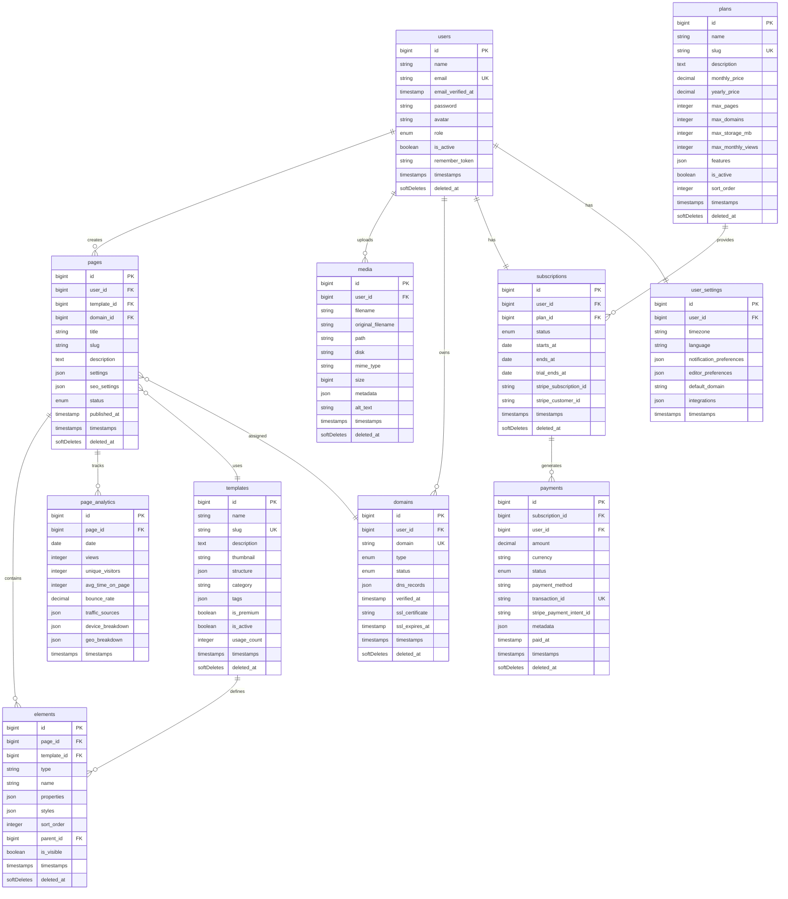

# Database Schema Documentation

## Overview

This document provides complete database schema documentation for the Landing Page Builder SaaS application using MySQL.

---

## ER Diagram



---

## Complete Migration Files

### 1. Users Table Migration

```php
<?php

use Illuminate\Database\Migrations\Migration;
use Illuminate\Database\Schema\Blueprint;
use Illuminate\Support\Facades\Schema;

return new class extends Migration
{
    /**
     * Run the migrations.
     */
    public function up(): void
    {
        Schema::create('users', function (Blueprint $table) {
            $table->id();
            $table->string('name');
            $table->string('email')->unique();
            $table->timestamp('email_verified_at')->nullable();
            $table->string('password');
            $table->string('avatar')->nullable();
            $table->enum('role', ['admin', 'user', 'editor'])->default('user');
            $table->boolean('is_active')->default(true);
            $table->rememberToken();
            $table->timestamps();
            $table->softDeletes();

            // Indexes
            $table->index('role');
            $table->index('is_active');
            $table->index('created_at');
            $table->index(['role', 'is_active']);
        });
    }

    /**
     * Reverse the migrations.
     */
    public function down(): void
    {
        Schema::dropIfExists('users');
    }
};
```

### 2. Plans Table Migration

```php
<?php

use Illuminate\Database\Migrations\Migration;
use Illuminate\Database\Schema\Blueprint;
use Illuminate\Support\Facades\Schema;

return new class extends Migration
{
    /**
     * Run the migrations.
     */
    public function up(): void
    {
        Schema::create('plans', function (Blueprint $table) {
            $table->id();
            $table->string('name');
            $table->string('slug')->unique();
            $table->text('description')->nullable();
            $table->decimal('monthly_price', 10, 2)->default(0);
            $table->decimal('yearly_price', 10, 2)->default(0);
            $table->integer('max_pages')->default(5);
            $table->integer('max_domains')->default(1);
            $table->integer('max_storage_mb')->default(500);
            $table->integer('max_monthly_views')->default(10000);
            $table->json('features')->nullable();
            $table->boolean('is_active')->default(true);
            $table->integer('sort_order')->default(0);
            $table->timestamps();
            $table->softDeletes();

            // Indexes
            $table->index('is_active');
            $table->index('sort_order');
            $table->index(['is_active', 'sort_order']);
        });
    }

    /**
     * Reverse the migrations.
     */
    public function down(): void
    {
        Schema::dropIfExists('plans');
    }
};
```

### 3. Subscriptions Table Migration

```php
<?php

use Illuminate\Database\Migrations\Migration;
use Illuminate\Database\Schema\Blueprint;
use Illuminate\Support\Facades\Schema;

return new class extends Migration
{
    /**
     * Run the migrations.
     */
    public function up(): void
    {
        Schema::create('subscriptions', function (Blueprint $table) {
            $table->id();
            $table->foreignId('user_id')->constrained()->onDelete('cascade');
            $table->foreignId('plan_id')->constrained()->onDelete('restrict');
            $table->enum('status', ['active', 'inactive', 'cancelled', 'past_due', 'trialing', 'paused'])->default('inactive');
            $table->date('starts_at')->nullable();
            $table->date('ends_at')->nullable();
            $table->date('trial_ends_at')->nullable();
            $table->string('stripe_subscription_id')->nullable();
            $table->string('stripe_customer_id')->nullable();
            $table->timestamps();
            $table->softDeletes();

            // Indexes
            $table->index('status');
            $table->index('ends_at');
            $table->index('trial_ends_at');
            $table->index('stripe_subscription_id');
            $table->index('stripe_customer_id');
            $table->index(['user_id', 'status']);
            $table->index(['status', 'ends_at']);
        });
    }

    /**
     * Reverse the migrations.
     */
    public function down(): void
    {
        Schema::dropIfExists('subscriptions');
    }
};
```

### 4. Payments Table Migration

```php
<?php

use Illuminate\Database\Migrations\Migration;
use Illuminate\Database\Schema\Blueprint;
use Illuminate\Support\Facades\Schema;

return new class extends Migration
{
    /**
     * Run the migrations.
     */
    public function up(): void
    {
        Schema::create('payments', function (Blueprint $table) {
            $table->id();
            $table->foreignId('subscription_id')->constrained()->onDelete('cascade');
            $table->foreignId('user_id')->constrained()->onDelete('cascade');
            $table->decimal('amount', 10, 2);
            $table->string('currency', 3)->default('USD');
            $table->enum('status', ['pending', 'completed', 'failed', 'refunded', 'cancelled'])->default('pending');
            $table->string('payment_method')->nullable();
            $table->string('transaction_id')->unique()->nullable();
            $table->string('stripe_payment_intent_id')->nullable();
            $table->json('metadata')->nullable();
            $table->timestamp('paid_at')->nullable();
            $table->timestamps();
            $table->softDeletes();

            // Indexes
            $table->index('status');
            $table->index('paid_at');
            $table->index('stripe_payment_intent_id');
            $table->index(['user_id', 'status']);
            $table->index(['subscription_id', 'status']);
            $table->index(['status', 'paid_at']);
        });
    }

    /**
     * Reverse the migrations.
     */
    public function down(): void
    {
        Schema::dropIfExists('payments');
    }
};
```

### 5. Templates Table Migration

```php
<?php

use Illuminate\Database\Migrations\Migration;
use Illuminate\Database\Schema\Blueprint;
use Illuminate\Support\Facades\Schema;

return new class extends Migration
{
    /**
     * Run the migrations.
     */
    public function up(): void
    {
        Schema::create('templates', function (Blueprint $table) {
            $table->id();
            $table->string('name');
            $table->string('slug')->unique();
            $table->text('description')->nullable();
            $table->string('thumbnail')->nullable();
            $table->json('structure')->nullable();
            $table->string('category')->default('general');
            $table->json('tags')->nullable();
            $table->boolean('is_premium')->default(false);
            $table->boolean('is_active')->default(true);
            $table->unsignedInteger('usage_count')->default(0);
            $table->timestamps();
            $table->softDeletes();

            // Indexes
            $table->index('category');
            $table->index('is_premium');
            $table->index('is_active');
            $table->index('usage_count');
            $table->index(['is_active', 'category']);
            $table->index(['is_active', 'is_premium']);
        });
    }

    /**
     * Reverse the migrations.
     */
    public function down(): void
    {
        Schema::dropIfExists('templates');
    }
};
```

### 6. Domains Table Migration

```php
<?php

use Illuminate\Database\Migrations\Migration;
use Illuminate\Database\Schema\Blueprint;
use Illuminate\Support\Facades\Schema;

return new class extends Migration
{
    /**
     * Run the migrations.
     */
    public function up(): void
    {
        Schema::create('domains', function (Blueprint $table) {
            $table->id();
            $table->foreignId('user_id')->constrained()->onDelete('cascade');
            $table->string('domain')->unique();
            $table->enum('type', ['subdomain', 'custom'])->default('subdomain');
            $table->enum('status', ['pending', 'active', 'failed', 'expired'])->default('pending');
            $table->json('dns_records')->nullable();
            $table->timestamp('verified_at')->nullable();
            $table->text('ssl_certificate')->nullable();
            $table->timestamp('ssl_expires_at')->nullable();
            $table->timestamps();
            $table->softDeletes();

            // Indexes
            $table->index('type');
            $table->index('status');
            $table->index('verified_at');
            $table->index(['user_id', 'status']);
            $table->index(['status', 'type']);
        });
    }

    /**
     * Reverse the migrations.
     */
    public function down(): void
    {
        Schema::dropIfExists('domains');
    }
};
```

### 7. Pages Table Migration

```php
<?php

use Illuminate\Database\Migrations\Migration;
use Illuminate\Database\Schema\Blueprint;
use Illuminate\Support\Facades\Schema;

return new class extends Migration
{
    /**
     * Run the migrations.
     */
    public function up(): void
    {
        Schema::create('pages', function (Blueprint $table) {
            $table->id();
            $table->foreignId('user_id')->constrained()->onDelete('cascade');
            $table->foreignId('template_id')->nullable()->constrained()->onDelete('set null');
            $table->foreignId('domain_id')->nullable()->constrained()->onDelete('set null');
            $table->string('title');
            $table->string('slug');
            $table->text('description')->nullable();
            $table->json('settings')->nullable();
            $table->json('seo_settings')->nullable();
            $table->enum('status', ['draft', 'published', 'archived', 'scheduled'])->default('draft');
            $table->timestamp('published_at')->nullable();
            $table->timestamps();
            $table->softDeletes();

            // Indexes
            $table->index('status');
            $table->index('published_at');
            $table->index(['user_id', 'slug']);
            $table->index(['user_id', 'status']);
            $table->index(['domain_id', 'slug']);
            $table->index(['status', 'published_at']);

            // Unique constraint for slug per user
            $table->unique(['user_id', 'slug']);
        });
    }

    /**
     * Reverse the migrations.
     */
    public function down(): void
    {
        Schema::dropIfExists('pages');
    }
};
```

### 8. Elements Table Migration

```php
<?php

use Illuminate\Database\Migrations\Migration;
use Illuminate\Database\Schema\Blueprint;
use Illuminate\Support\Facades\Schema;

return new class extends Migration
{
    /**
     * Run the migrations.
     */
    public function up(): void
    {
        Schema::create('elements', function (Blueprint $table) {
            $table->id();
            $table->foreignId('page_id')->nullable()->constrained()->onDelete('cascade');
            $table->foreignId('template_id')->nullable()->constrained()->onDelete('cascade');
            $table->string('type');
            $table->string('name')->nullable();
            $table->json('properties')->nullable();
            $table->json('styles')->nullable();
            $table->integer('sort_order')->default(0);
            $table->unsignedBigInteger('parent_id')->nullable();
            $table->boolean('is_visible')->default(true);
            $table->timestamps();
            $table->softDeletes();

            // Self-referential foreign key
            $table->foreign('parent_id')->references('id')->on('elements')->onDelete('cascade');

            // Indexes
            $table->index('type');
            $table->index('sort_order');
            $table->index('parent_id');
            $table->index('is_visible');
            $table->index(['page_id', 'sort_order']);
            $table->index(['template_id', 'sort_order']);
            $table->index(['page_id', 'is_visible']);
        });
    }

    /**
     * Reverse the migrations.
     */
    public function down(): void
    {
        Schema::dropIfExists('elements');
    }
};
```

### 9. Media Table Migration

```php
<?php

use Illuminate\Database\Migrations\Migration;
use Illuminate\Database\Schema\Blueprint;
use Illuminate\Support\Facades\Schema;

return new class extends Migration
{
    /**
     * Run the migrations.
     */
    public function up(): void
    {
        Schema::create('media', function (Blueprint $table) {
            $table->id();
            $table->foreignId('user_id')->constrained()->onDelete('cascade');
            $table->string('filename');
            $table->string('original_filename');
            $table->string('path');
            $table->string('disk')->default('public');
            $table->string('mime_type');
            $table->unsignedBigInteger('size');
            $table->json('metadata')->nullable();
            $table->string('alt_text')->nullable();
            $table->timestamps();
            $table->softDeletes();

            // Indexes
            $table->index('mime_type');
            $table->index('disk');
            $table->index('created_at');
            $table->index(['user_id', 'mime_type']);
            $table->index(['user_id', 'created_at']);
        });
    }

    /**
     * Reverse the migrations.
     */
    public function down(): void
    {
        Schema::dropIfExists('media');
    }
};
```

### 10. Page Analytics Table Migration

```php
<?php

use Illuminate\Database\Migrations\Migration;
use Illuminate\Database\Schema\Blueprint;
use Illuminate\Support\Facades\Schema;

return new class extends Migration
{
    /**
     * Run the migrations.
     */
    public function up(): void
    {
        Schema::create('page_analytics', function (Blueprint $table) {
            $table->id();
            $table->foreignId('page_id')->constrained()->onDelete('cascade');
            $table->date('date');
            $table->unsignedInteger('views')->default(0);
            $table->unsignedInteger('unique_visitors')->default(0);
            $table->unsignedInteger('avg_time_on_page')->default(0);
            $table->decimal('bounce_rate', 5, 2)->default(0);
            $table->json('traffic_sources')->nullable();
            $table->json('device_breakdown')->nullable();
            $table->json('geo_breakdown')->nullable();
            $table->timestamps();

            // Indexes
            $table->index('date');
            $table->index(['page_id', 'date']);
            $table->unique(['page_id', 'date']);
        });
    }

    /**
     * Reverse the migrations.
     */
    public function down(): void
    {
        Schema::dropIfExists('page_analytics');
    }
};
```

### 11. User Settings Table Migration

```php
<?php

use Illuminate\Database\Migrations\Migration;
use Illuminate\Database\Schema\Blueprint;
use Illuminate\Support\Facades\Schema;

return new class extends Migration
{
    /**
     * Run the migrations.
     */
    public function up(): void
    {
        Schema::create('user_settings', function (Blueprint $table) {
            $table->id();
            $table->foreignId('user_id')->unique()->constrained()->onDelete('cascade');
            $table->string('timezone')->default('UTC');
            $table->string('language', 10)->default('en');
            $table->json('notification_preferences')->nullable();
            $table->json('editor_preferences')->nullable();
            $table->string('default_domain')->nullable();
            $table->json('integrations')->nullable();
            $table->timestamps();

            // Indexes
            $table->index('timezone');
            $table->index('language');
        });
    }

    /**
     * Reverse the migrations.
     */
    public function down(): void
    {
        Schema::dropIfExists('user_settings');
    }
};
```

---

## Indexes & Foreign Keys Summary

### Foreign Key Relationships

| Table | Column | References | On Delete |
|-------|--------|------------|-----------|
| subscriptions | user_id | users.id | CASCADE |
| subscriptions | plan_id | plans.id | RESTRICT |
| payments | subscription_id | subscriptions.id | CASCADE |
| payments | user_id | users.id | CASCADE |
| domains | user_id | users.id | CASCADE |
| pages | user_id | users.id | CASCADE |
| pages | template_id | templates.id | SET NULL |
| pages | domain_id | domains.id | SET NULL |
| elements | page_id | pages.id | CASCADE |
| elements | template_id | templates.id | CASCADE |
| elements | parent_id | elements.id | CASCADE |
| media | user_id | users.id | CASCADE |
| page_analytics | page_id | pages.id | CASCADE |
| user_settings | user_id | users.id | CASCADE |

### Composite Indexes

| Table | Index Columns | Purpose |
|-------|---------------|---------|
| users | role, is_active | Filter active users by role |
| subscriptions | user_id, status | User subscription lookup |
| subscriptions | status, ends_at | Expiring subscriptions query |
| payments | user_id, status | User payment history |
| payments | status, paid_at | Payment reporting |
| templates | is_active, category | Template browsing |
| pages | user_id, slug | Page lookup by user |
| pages | domain_id, slug | Page routing |
| elements | page_id, sort_order | Element ordering |
| page_analytics | page_id, date | Analytics queries |

---

## Seeders

### Plans Seeder

```php
<?php

namespace Database\Seeders;

use Illuminate\Database\Seeder;
use App\Models\Plan;

class PlanSeeder extends Seeder
{
    /**
     * Run the database seeds.
     */
    public function run(): void
    {
        $plans = [
            [
                'name' => 'Free',
                'slug' => 'free',
                'description' => 'Perfect for getting started with landing pages',
                'monthly_price' => 0,
                'yearly_price' => 0,
                'max_pages' => 3,
                'max_domains' => 1,
                'max_storage_mb' => 100,
                'max_monthly_views' => 1000,
                'features' => json_encode([
                    'basic_templates' => true,
                    'custom_domains' => false,
                    'analytics' => false,
                    'remove_branding' => false,
                    'priority_support' => false,
                    'a_b_testing' => false,
                ]),
                'is_active' => true,
                'sort_order' => 1,
            ],
            [
                'name' => 'Starter',
                'slug' => 'starter',
                'description' => 'For individuals and small projects',
                'monthly_price' => 9.99,
                'yearly_price' => 99.99,
                'max_pages' => 10,
                'max_domains' => 2,
                'max_storage_mb' => 500,
                'max_monthly_views' => 10000,
                'features' => json_encode([
                    'basic_templates' => true,
                    'premium_templates' => true,
                    'custom_domains' => true,
                    'analytics' => true,
                    'remove_branding' => false,
                    'priority_support' => false,
                    'a_b_testing' => false,
                ]),
                'is_active' => true,
                'sort_order' => 2,
            ],
            [
                'name' => 'Professional',
                'slug' => 'professional',
                'description' => 'For growing businesses and teams',
                'monthly_price' => 29.99,
                'yearly_price' => 299.99,
                'max_pages' => 50,
                'max_domains' => 10,
                'max_storage_mb' => 2000,
                'max_monthly_views' => 100000,
                'features' => json_encode([
                    'basic_templates' => true,
                    'premium_templates' => true,
                    'custom_domains' => true,
                    'analytics' => true,
                    'remove_branding' => true,
                    'priority_support' => true,
                    'a_b_testing' => true,
                    'team_collaboration' => true,
                ]),
                'is_active' => true,
                'sort_order' => 3,
            ],
            [
                'name' => 'Enterprise',
                'slug' => 'enterprise',
                'description' => 'For large organizations with custom needs',
                'monthly_price' => 99.99,
                'yearly_price' => 999.99,
                'max_pages' => -1, // Unlimited
                'max_domains' => -1, // Unlimited
                'max_storage_mb' => 10000,
                'max_monthly_views' => -1, // Unlimited
                'features' => json_encode([
                    'basic_templates' => true,
                    'premium_templates' => true,
                    'custom_domains' => true,
                    'analytics' => true,
                    'remove_branding' => true,
                    'priority_support' => true,
                    'a_b_testing' => true,
                    'team_collaboration' => true,
                    'api_access' => true,
                    'white_label' => true,
                    'dedicated_support' => true,
                    'sla' => true,
                ]),
                'is_active' => true,
                'sort_order' => 4,
            ],
        ];

        foreach ($plans as $plan) {
            Plan::create($plan);
        }
    }
}
```

### Templates Seeder

```php
<?php

namespace Database\Seeders;

use Illuminate\Database\Seeder;
use App\Models\Template;

class TemplateSeeder extends Seeder
{
    /**
     * Run the database seeds.
     */
    public function run(): void
    {
        $templates = [
            [
                'name' => 'Blank Canvas',
                'slug' => 'blank-canvas',
                'description' => 'Start from scratch with a completely blank template',
                'thumbnail' => '/templates/thumbnails/blank-canvas.png',
                'structure' => json_encode([
                    'sections' => [],
                    'settings' => [
                        'backgroundColor' => '#ffffff',
                        'fontFamily' => 'Inter',
                    ],
                ]),
                'category' => 'general',
                'tags' => json_encode(['blank', 'minimal', 'starter']),
                'is_premium' => false,
                'is_active' => true,
                'usage_count' => 0,
            ],
            [
                'name' => 'SaaS Product Launch',
                'slug' => 'saas-product-launch',
                'description' => 'Perfect for launching your SaaS product with hero, features, pricing, and CTA sections',
                'thumbnail' => '/templates/thumbnails/saas-launch.png',
                'structure' => json_encode([
                    'sections' => [
                        ['type' => 'hero', 'variant' => 'centered'],
                        ['type' => 'features', 'variant' => 'grid-3'],
                        ['type' => 'pricing', 'variant' => 'three-tier'],
                        ['type' => 'testimonials', 'variant' => 'carousel'],
                        ['type' => 'cta', 'variant' => 'simple'],
                        ['type' => 'footer', 'variant' => 'standard'],
                    ],
                    'settings' => [
                        'backgroundColor' => '#f8fafc',
                        'fontFamily' => 'Inter',
                        'primaryColor' => '#3b82f6',
                    ],
                ]),
                'category' => 'saas',
                'tags' => json_encode(['saas', 'product', 'launch', 'startup']),
                'is_premium' => false,
                'is_active' => true,
                'usage_count' => 0,
            ],
            [
                'name' => 'Lead Generation',
                'slug' => 'lead-generation',
                'description' => 'Optimized for capturing leads with compelling copy and strong CTAs',
                'thumbnail' => '/templates/thumbnails/lead-gen.png',
                'structure' => json_encode([
                    'sections' => [
                        ['type' => 'hero', 'variant' => 'split-form'],
                        ['type' => 'benefits', 'variant' => 'icons'],
                        ['type' => 'social-proof', 'variant' => 'logos'],
                        ['type' => 'form', 'variant' => 'detailed'],
                        ['type' => 'footer', 'variant' => 'minimal'],
                    ],
                    'settings' => [
                        'backgroundColor' => '#ffffff',
                        'fontFamily' => 'Poppins',
                        'primaryColor' => '#10b981',
                    ],
                ]),
                'category' => 'marketing',
                'tags' => json_encode(['leads', 'conversion', 'marketing', 'form']),
                'is_premium' => false,
                'is_active' => true,
                'usage_count' => 0,
            ],
            [
                'name' => 'Event Registration',
                'slug' => 'event-registration',
                'description' => 'Great for webinars, conferences, and online events',
                'thumbnail' => '/templates/thumbnails/event.png',
                'structure' => json_encode([
                    'sections' => [
                        ['type' => 'hero', 'variant' => 'event'],
                        ['type' => 'countdown', 'variant' => 'large'],
                        ['type' => 'speakers', 'variant' => 'grid'],
                        ['type' => 'agenda', 'variant' => 'timeline'],
                        ['type' => 'registration', 'variant' => 'modal'],
                        ['type' => 'footer', 'variant' => 'event'],
                    ],
                    'settings' => [
                        'backgroundColor' => '#1e1e2e',
                        'fontFamily' => 'Montserrat',
                        'primaryColor' => '#8b5cf6',
                    ],
                ]),
                'category' => 'events',
                'tags' => json_encode(['event', 'webinar', 'conference', 'registration']),
                'is_premium' => true,
                'is_active' => true,
                'usage_count' => 0,
            ],
            [
                'name' => 'E-commerce Product',
                'slug' => 'ecommerce-product',
                'description' => 'Showcase a single product with gallery, features, and purchase CTA',
                'thumbnail' => '/templates/thumbnails/ecommerce.png',
                'structure' => json_encode([
                    'sections' => [
                        ['type' => 'product-hero', 'variant' => 'gallery'],
                        ['type' => 'product-features', 'variant' => 'tabs'],
                        ['type' => 'reviews', 'variant' => 'stars'],
                        ['type' => 'related-products', 'variant' => 'carousel'],
                        ['type' => 'footer', 'variant' => 'ecommerce'],
                    ],
                    'settings' => [
                        'backgroundColor' => '#ffffff',
                        'fontFamily' => 'DM Sans',
                        'primaryColor' => '#f59e0b',
                    ],
                ]),
                'category' => 'ecommerce',
                'tags' => json_encode(['product', 'shop', 'ecommerce', 'store']),
                'is_premium' => true,
                'is_active' => true,
                'usage_count' => 0,
            ],
            [
                'name' => 'Portfolio Showcase',
                'slug' => 'portfolio-showcase',
                'description' => 'Display your work with an elegant portfolio layout',
                'thumbnail' => '/templates/thumbnails/portfolio.png',
                'structure' => json_encode([
                    'sections' => [
                        ['type' => 'hero', 'variant' => 'personal'],
                        ['type' => 'portfolio', 'variant' => 'masonry'],
                        ['type' => 'about', 'variant' => 'bio'],
                        ['type' => 'contact', 'variant' => 'simple'],
                        ['type' => 'footer', 'variant' => 'social'],
                    ],
                    'settings' => [
                        'backgroundColor' => '#fafafa',
                        'fontFamily' => 'Playfair Display',
                        'primaryColor' => '#1f2937',
                    ],
                ]),
                'category' => 'portfolio',
                'tags' => json_encode(['portfolio', 'creative', 'personal', 'showcase']),
                'is_premium' => true,
                'is_active' => true,
                'usage_count' => 0,
            ],
        ];

        foreach ($templates as $template) {
            Template::create($template);
        }
    }
}
```

### Admin User Seeder

```php
<?php

namespace Database\Seeders;

use Illuminate\Database\Seeder;
use App\Models\User;
use App\Models\UserSettings;
use App\Models\Subscription;
use App\Models\Plan;
use Illuminate\Support\Facades\Hash;

class AdminUserSeeder extends Seeder
{
    /**
     * Run the database seeds.
     */
    public function run(): void
    {
        // Create admin user
        $admin = User::create([
            'name' => 'Admin User',
            'email' => 'admin@landingpagebuilder.com',
            'email_verified_at' => now(),
            'password' => Hash::make('password123!'),
            'role' => 'admin',
            'is_active' => true,
        ]);

        // Create user settings for admin
        UserSettings::create([
            'user_id' => $admin->id,
            'timezone' => 'UTC',
            'language' => 'en',
            'notification_preferences' => json_encode([
                'email_marketing' => false,
                'email_updates' => true,
                'email_security' => true,
                'push_notifications' => true,
            ]),
            'editor_preferences' => json_encode([
                'theme' => 'dark',
                'autosave' => true,
                'grid_snap' => true,
                'show_guides' => true,
            ]),
        ]);

        // Get enterprise plan and create subscription
        $enterprisePlan = Plan::where('slug', 'enterprise')->first();

        if ($enterprisePlan) {
            Subscription::create([
                'user_id' => $admin->id,
                'plan_id' => $enterprisePlan->id,
                'status' => 'active',
                'starts_at' => now(),
                'ends_at' => now()->addYears(100), // Essentially unlimited
            ]);
        }

        // Create a demo user
        $demoUser = User::create([
            'name' => 'Demo User',
            'email' => 'demo@landingpagebuilder.com',
            'email_verified_at' => now(),
            'password' => Hash::make('demo123!'),
            'role' => 'user',
            'is_active' => true,
        ]);

        // Create user settings for demo user
        UserSettings::create([
            'user_id' => $demoUser->id,
            'timezone' => 'America/New_York',
            'language' => 'en',
            'notification_preferences' => json_encode([
                'email_marketing' => true,
                'email_updates' => true,
                'email_security' => true,
                'push_notifications' => false,
            ]),
            'editor_preferences' => json_encode([
                'theme' => 'light',
                'autosave' => true,
                'grid_snap' => false,
                'show_guides' => true,
            ]),
        ]);

        // Get starter plan and create subscription for demo user
        $starterPlan = Plan::where('slug', 'starter')->first();

        if ($starterPlan) {
            Subscription::create([
                'user_id' => $demoUser->id,
                'plan_id' => $starterPlan->id,
                'status' => 'active',
                'starts_at' => now(),
                'ends_at' => now()->addMonth(),
                'trial_ends_at' => now()->addDays(14),
            ]);
        }
    }
}
```

### Database Seeder (Main)

```php
<?php

namespace Database\Seeders;

use Illuminate\Database\Seeder;

class DatabaseSeeder extends Seeder
{
    /**
     * Seed the application's database.
     */
    public function run(): void
    {
        $this->call([
            PlanSeeder::class,
            TemplateSeeder::class,
            AdminUserSeeder::class,
        ]);
    }
}
```

---

## Model Relationships

### User Model

```php
<?php

namespace App\Models;

use Illuminate\Database\Eloquent\Factories\HasFactory;
use Illuminate\Database\Eloquent\SoftDeletes;
use Illuminate\Foundation\Auth\User as Authenticatable;
use Illuminate\Notifications\Notifiable;

class User extends Authenticatable
{
    use HasFactory, Notifiable, SoftDeletes;

    protected $fillable = [
        'name',
        'email',
        'password',
        'avatar',
        'role',
        'is_active',
    ];

    protected $hidden = [
        'password',
        'remember_token',
    ];

    protected $casts = [
        'email_verified_at' => 'datetime',
        'password' => 'hashed',
        'is_active' => 'boolean',
    ];

    // Relationships
    public function pages()
    {
        return $this->hasMany(Page::class);
    }

    public function media()
    {
        return $this->hasMany(Media::class);
    }

    public function domains()
    {
        return $this->hasMany(Domain::class);
    }

    public function subscription()
    {
        return $this->hasOne(Subscription::class)->latestOfMany();
    }

    public function subscriptions()
    {
        return $this->hasMany(Subscription::class);
    }

    public function payments()
    {
        return $this->hasMany(Payment::class);
    }

    public function settings()
    {
        return $this->hasOne(UserSettings::class);
    }

    // Helper methods
    public function isAdmin(): bool
    {
        return $this->role === 'admin';
    }

    public function hasActivePlan(): bool
    {
        return $this->subscription && $this->subscription->status === 'active';
    }

    public function currentPlan()
    {
        return $this->subscription?->plan;
    }
}
```

### Plan Model

```php
<?php

namespace App\Models;

use Illuminate\Database\Eloquent\Factories\HasFactory;
use Illuminate\Database\Eloquent\Model;
use Illuminate\Database\Eloquent\SoftDeletes;

class Plan extends Model
{
    use HasFactory, SoftDeletes;

    protected $fillable = [
        'name',
        'slug',
        'description',
        'monthly_price',
        'yearly_price',
        'max_pages',
        'max_domains',
        'max_storage_mb',
        'max_monthly_views',
        'features',
        'is_active',
        'sort_order',
    ];

    protected $casts = [
        'monthly_price' => 'decimal:2',
        'yearly_price' => 'decimal:2',
        'features' => 'array',
        'is_active' => 'boolean',
    ];

    // Relationships
    public function subscriptions()
    {
        return $this->hasMany(Subscription::class);
    }

    // Helper methods
    public function hasFeature(string $feature): bool
    {
        return isset($this->features[$feature]) && $this->features[$feature] === true;
    }

    public function isUnlimited(string $limit): bool
    {
        return $this->{$limit} === -1;
    }
}
```

### Subscription Model

```php
<?php

namespace App\Models;

use Illuminate\Database\Eloquent\Factories\HasFactory;
use Illuminate\Database\Eloquent\Model;
use Illuminate\Database\Eloquent\SoftDeletes;

class Subscription extends Model
{
    use HasFactory, SoftDeletes;

    protected $fillable = [
        'user_id',
        'plan_id',
        'status',
        'starts_at',
        'ends_at',
        'trial_ends_at',
        'stripe_subscription_id',
        'stripe_customer_id',
    ];

    protected $casts = [
        'starts_at' => 'date',
        'ends_at' => 'date',
        'trial_ends_at' => 'date',
    ];

    // Relationships
    public function user()
    {
        return $this->belongsTo(User::class);
    }

    public function plan()
    {
        return $this->belongsTo(Plan::class);
    }

    public function payments()
    {
        return $this->hasMany(Payment::class);
    }

    // Helper methods
    public function isActive(): bool
    {
        return $this->status === 'active';
    }

    public function isOnTrial(): bool
    {
        return $this->status === 'trialing' && $this->trial_ends_at?->isFuture();
    }

    public function isExpired(): bool
    {
        return $this->ends_at && $this->ends_at->isPast();
    }
}
```

### Payment Model

```php
<?php

namespace App\Models;

use Illuminate\Database\Eloquent\Factories\HasFactory;
use Illuminate\Database\Eloquent\Model;
use Illuminate\Database\Eloquent\SoftDeletes;

class Payment extends Model
{
    use HasFactory, SoftDeletes;

    protected $fillable = [
        'subscription_id',
        'user_id',
        'amount',
        'currency',
        'status',
        'payment_method',
        'transaction_id',
        'stripe_payment_intent_id',
        'metadata',
        'paid_at',
    ];

    protected $casts = [
        'amount' => 'decimal:2',
        'metadata' => 'array',
        'paid_at' => 'datetime',
    ];

    // Relationships
    public function subscription()
    {
        return $this->belongsTo(Subscription::class);
    }

    public function user()
    {
        return $this->belongsTo(User::class);
    }

    // Helper methods
    public function isCompleted(): bool
    {
        return $this->status === 'completed';
    }

    public function formattedAmount(): string
    {
        return number_format($this->amount, 2) . ' ' . strtoupper($this->currency);
    }
}
```

### Template Model

```php
<?php

namespace App\Models;

use Illuminate\Database\Eloquent\Factories\HasFactory;
use Illuminate\Database\Eloquent\Model;
use Illuminate\Database\Eloquent\SoftDeletes;

class Template extends Model
{
    use HasFactory, SoftDeletes;

    protected $fillable = [
        'name',
        'slug',
        'description',
        'thumbnail',
        'structure',
        'category',
        'tags',
        'is_premium',
        'is_active',
        'usage_count',
    ];

    protected $casts = [
        'structure' => 'array',
        'tags' => 'array',
        'is_premium' => 'boolean',
        'is_active' => 'boolean',
    ];

    // Relationships
    public function pages()
    {
        return $this->hasMany(Page::class);
    }

    public function elements()
    {
        return $this->hasMany(Element::class);
    }

    // Helper methods
    public function incrementUsage(): void
    {
        $this->increment('usage_count');
    }
}
```

### Page Model

```php
<?php

namespace App\Models;

use Illuminate\Database\Eloquent\Factories\HasFactory;
use Illuminate\Database\Eloquent\Model;
use Illuminate\Database\Eloquent\SoftDeletes;

class Page extends Model
{
    use HasFactory, SoftDeletes;

    protected $fillable = [
        'user_id',
        'template_id',
        'domain_id',
        'title',
        'slug',
        'description',
        'settings',
        'seo_settings',
        'status',
        'published_at',
    ];

    protected $casts = [
        'settings' => 'array',
        'seo_settings' => 'array',
        'published_at' => 'datetime',
    ];

    // Relationships
    public function user()
    {
        return $this->belongsTo(User::class);
    }

    public function template()
    {
        return $this->belongsTo(Template::class);
    }

    public function domain()
    {
        return $this->belongsTo(Domain::class);
    }

    public function elements()
    {
        return $this->hasMany(Element::class)->orderBy('sort_order');
    }

    public function analytics()
    {
        return $this->hasMany(PageAnalytics::class);
    }

    // Helper methods
    public function isPublished(): bool
    {
        return $this->status === 'published';
    }

    public function publish(): void
    {
        $this->update([
            'status' => 'published',
            'published_at' => now(),
        ]);
    }

    public function getFullUrl(): string
    {
        $domain = $this->domain?->domain ?? config('app.url');
        return "https://{$domain}/{$this->slug}";
    }
}
```

### Element Model

```php
<?php

namespace App\Models;

use Illuminate\Database\Eloquent\Factories\HasFactory;
use Illuminate\Database\Eloquent\Model;
use Illuminate\Database\Eloquent\SoftDeletes;

class Element extends Model
{
    use HasFactory, SoftDeletes;

    protected $fillable = [
        'page_id',
        'template_id',
        'type',
        'name',
        'properties',
        'styles',
        'sort_order',
        'parent_id',
        'is_visible',
    ];

    protected $casts = [
        'properties' => 'array',
        'styles' => 'array',
        'is_visible' => 'boolean',
    ];

    // Relationships
    public function page()
    {
        return $this->belongsTo(Page::class);
    }

    public function template()
    {
        return $this->belongsTo(Template::class);
    }

    public function parent()
    {
        return $this->belongsTo(Element::class, 'parent_id');
    }

    public function children()
    {
        return $this->hasMany(Element::class, 'parent_id')->orderBy('sort_order');
    }

    // Recursive relationship for nested elements
    public function allChildren()
    {
        return $this->children()->with('allChildren');
    }
}
```

### Media Model

```php
<?php

namespace App\Models;

use Illuminate\Database\Eloquent\Factories\HasFactory;
use Illuminate\Database\Eloquent\Model;
use Illuminate\Database\Eloquent\SoftDeletes;
use Illuminate\Support\Facades\Storage;

class Media extends Model
{
    use HasFactory, SoftDeletes;

    protected $fillable = [
        'user_id',
        'filename',
        'original_filename',
        'path',
        'disk',
        'mime_type',
        'size',
        'metadata',
        'alt_text',
    ];

    protected $casts = [
        'metadata' => 'array',
        'size' => 'integer',
    ];

    // Relationships
    public function user()
    {
        return $this->belongsTo(User::class);
    }

    // Helper methods
    public function getUrl(): string
    {
        return Storage::disk($this->disk)->url($this->path);
    }

    public function getFormattedSize(): string
    {
        $units = ['B', 'KB', 'MB', 'GB'];
        $size = $this->size;
        $unit = 0;

        while ($size >= 1024 && $unit < count($units) - 1) {
            $size /= 1024;
            $unit++;
        }

        return round($size, 2) . ' ' . $units[$unit];
    }

    public function isImage(): bool
    {
        return str_starts_with($this->mime_type, 'image/');
    }
}
```

### Domain Model

```php
<?php

namespace App\Models;

use Illuminate\Database\Eloquent\Factories\HasFactory;
use Illuminate\Database\Eloquent\Model;
use Illuminate\Database\Eloquent\SoftDeletes;

class Domain extends Model
{
    use HasFactory, SoftDeletes;

    protected $fillable = [
        'user_id',
        'domain',
        'type',
        'status',
        'dns_records',
        'verified_at',
        'ssl_certificate',
        'ssl_expires_at',
    ];

    protected $casts = [
        'dns_records' => 'array',
        'verified_at' => 'datetime',
        'ssl_expires_at' => 'datetime',
    ];

    // Relationships
    public function user()
    {
        return $this->belongsTo(User::class);
    }

    public function pages()
    {
        return $this->hasMany(Page::class);
    }

    // Helper methods
    public function isVerified(): bool
    {
        return $this->status === 'active' && $this->verified_at !== null;
    }

    public function hasValidSsl(): bool
    {
        return $this->ssl_certificate && $this->ssl_expires_at?->isFuture();
    }
}
```

### PageAnalytics Model

```php
<?php

namespace App\Models;

use Illuminate\Database\Eloquent\Factories\HasFactory;
use Illuminate\Database\Eloquent\Model;

class PageAnalytics extends Model
{
    use HasFactory;

    protected $fillable = [
        'page_id',
        'date',
        'views',
        'unique_visitors',
        'avg_time_on_page',
        'bounce_rate',
        'traffic_sources',
        'device_breakdown',
        'geo_breakdown',
    ];

    protected $casts = [
        'date' => 'date',
        'bounce_rate' => 'decimal:2',
        'traffic_sources' => 'array',
        'device_breakdown' => 'array',
        'geo_breakdown' => 'array',
    ];

    // Relationships
    public function page()
    {
        return $this->belongsTo(Page::class);
    }
}
```

### UserSettings Model

```php
<?php

namespace App\Models;

use Illuminate\Database\Eloquent\Factories\HasFactory;
use Illuminate\Database\Eloquent\Model;

class UserSettings extends Model
{
    use HasFactory;

    protected $fillable = [
        'user_id',
        'timezone',
        'language',
        'notification_preferences',
        'editor_preferences',
        'default_domain',
        'integrations',
    ];

    protected $casts = [
        'notification_preferences' => 'array',
        'editor_preferences' => 'array',
        'integrations' => 'array',
    ];

    // Relationships
    public function user()
    {
        return $this->belongsTo(User::class);
    }
}
```

---

## Running Migrations and Seeders

```bash
# Run all migrations
php artisan migrate

# Run specific seeder
php artisan db:seed --class=PlanSeeder
php artisan db:seed --class=TemplateSeeder
php artisan db:seed --class=AdminUserSeeder

# Run all seeders
php artisan db:seed

# Fresh migration with seeders
php artisan migrate:fresh --seed
```

---

## Default Credentials

After running seeders, use these credentials:

**Admin User:**
- Email: `admin@landingpagebuilder.com`
- Password: `password123!`

**Demo User:**
- Email: `demo@landingpagebuilder.com`
- Password: `demo123!`

---

## Notes

1. **Soft Deletes**: Most tables use soft deletes to preserve data integrity and allow recovery
2. **JSON Columns**: Used for flexible data storage (features, settings, metadata)
3. **Indexing Strategy**: Composite indexes on frequently queried column combinations
4. **Foreign Key Cascades**: Configured based on business logic (CASCADE for owned resources, RESTRICT/SET NULL for references)
5. **Timestamps**: All tables include created_at and updated_at columns
